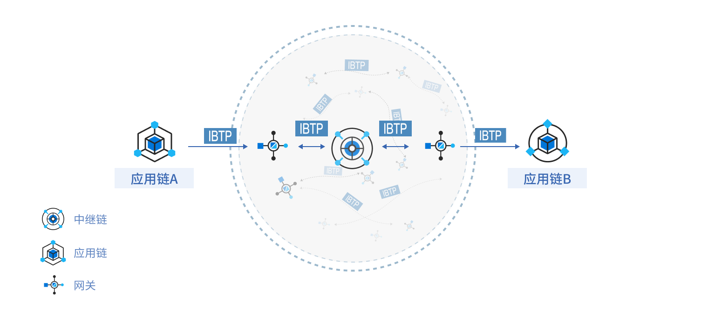
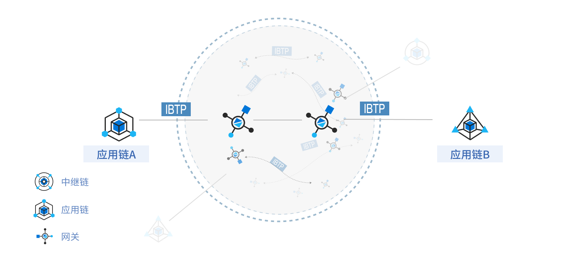
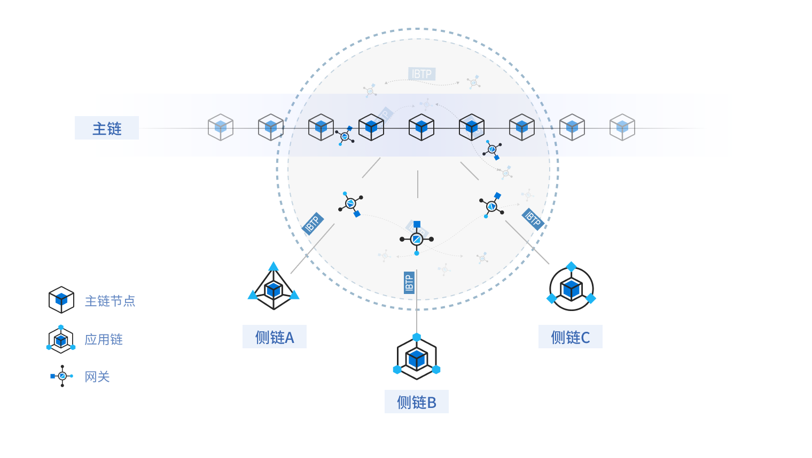

# 中继链架构

中继链架构由中继链和跨链网关组成。对于简单跨链场景，如下图所示，应用链 A 和应用链 B 之间的跨链操作，中继链 A 负责跨链交易的验证和存证，跨链网关在中继链和应用链间负责跨链交易的监听、同步和执行。

但由于中继链接入应用链的数量有限，为了更好地满足大规模跨链场景，需要接入多个中继链进行跨链。中继链间跨链通过跨链网关组成的跨链交易路由网络进行路由。如上图所示，应用链 A 想发送跨链交易到应用链 B 时，首先需要把跨链交易提交到中继链 A 中，跨链网关 A 同步到该跨链交易后，发现目的链不在中继链 A 负责的应用链联盟里面，就把跨链交易同步到跨链交易路由网络中。跨链网关B从路由网络中同步到该跨链交易后，提交到中继链 B，最后，由跨链网关提交到应用链 D 完成整个跨链操作。

中继链架构适用于安全性、可追溯性比较高的场景，可构建大规模异构区块链跨链网络。

# 链对链架构

对于安全性要求不高的场景，可以不借助中继链进行跨链操作，下图是由跨链网关组成的链对链架构。如应用链 A 和应用链 B 的跨链互操作直接通过中间的跨链路由网络进行跨链交易的同步和传输，跨链交易的真实性验证也由跨链网关完成。

# 主侧链架构

如果参与方存在上下级的治理关系，可以选用主侧链架构。如下图所示，中继链充当主链，负责侧链成员管理、数据一致性保障、核心数据存证等，且中继链的不可篡改特性可以方便实现跨链交易的原子性保障，中继链通过高性能智能合约的方式将跨链安全性验证规则化，方便实现异构区块链之间跨链交易验证的方法注入、升级；侧链通过跨链网关接入主链，负责承载具体的业务服务，形成可横向扩展的侧链集群。采用跨链网关的方式对接具体的应用侧链可以减少对具体数据治理链的侵入性，特别是针对异构数据治理链，网关可以将跨链交易转换成中继可解析验证的格式，对跨链互联服务屏蔽具体区块链的数据差异性；网关和中继链分离的方案可以保证中继链的稳定性。

