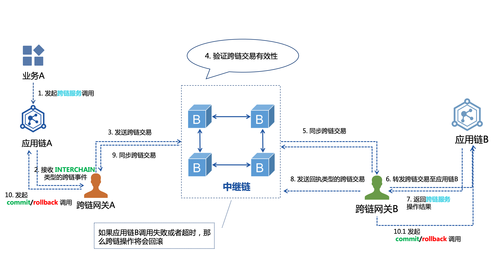

# 跨链交易基本流程

一个典型的跨链交易流程如下图所示，图中各模块具体含义如下：

- `Application A` / `Application B`：参与跨链的两条应用链A与应用链B。
- `App-chain A` / `App-chain B`：应用链插件A与应用链插件B，适配不同的应用链发出的跨链交易。
- `Pier A` / `Pier B`：网关A与网关B，用于转发跨链交易，是应用链与中继链的中转站。
- `BitXHub`：中继链，用于跨链交易验证。

具体的交易执行流程如下：

#### 1. broker合约抛出跨链事件

以具体的跨链交易事件为例，如数据交换场景：应用链A想获取应用链B的某个数据。SDK 调用具体的应用链 A 的业务合约`data_swapper`合约的 get 方法，该方法需指定应用链B的 ChainID ，然后调用`broker`合约方法，抛出跨链事件TA。

#### 2. 跨链网关监听跨链事件

跨链网关 A 通过应用链插件 A 监听到跨链事件Ta，应用链插件实质为跨链网关与应用链的交互模块，其设计思想参考[跨链网关设计方案](/v1.11/bitxhub/design/pier/)。

#### 3. 跨链网关转发跨链事件

跨链网关 A 将跨链交易格式转换为中继链通用的<a href="/v1.11/bitxhub/introduction/summary/#ibtpAnchor">IBTP结构</a>，并将IBTP封装为bxh交易类型 bxhTx1 提交到中继链BitXHub上，bxh交易类型如下图所示。

| 参数      | 说明                                    |
| --------- | --------------------------------------- |
| From      | 跨链网关 A 的地址，由跨链网关的私钥生成 |
| To        | bitXHub处理跨链交易的合约地址           |
| IBTP      | 跨链网关将跨链事件Ta封装为ibtp类型      |
| Nonce     | ibtp的索引                              |
| Timestamp | 跨链事件发生时间戳                      |
| …………      |                                         |

#### 4. 中继链处理跨链交易

BitXHub 收到跨链交易后，将进行以下处理：

1. 对 bxhTx1 进行基本验证，如验证交易的Nonce与签名的合法性；

2. 将交易交由共识模块处理，负责共识出块；

3. 出块完成后，交由执行模块处理；

4. 执行模块交由验证引擎验证区块的所有交易的有效性和存在性，并对交易根据发送的目的地址进行分类，处理完毕后交由路由模块；

5. 路由模块根据地址将封装后的跨链交易bxhTxWrapper路由到对应的跨链网关，TxWrapper交易类型如下图所示。

   | 参数         | 说明                                              |
   | ------------ | ------------------------------------------------- |
   | L2Roots      | 不同的目的应用链的交易构成的merkleRoot集合        |
   | Transactions | 验证后交易集合，valid字段表明交易是否验证通过     |
   | Height       | 交易所在的区块高度，与L2Roots一起用于跨链网关验证 |

#### 5. 跨链网关监听中继链交易

验证跨链交易所在区块在中继链的存在性：

- 跨链网关 B 监听到来自中继链的交易bxhTxWrapper，跨链网关可以根据bxhTxWrapper的L2Roots字段构建当前区块的txRoot1；

- 与此同时，跨链网关将拉取中继链的区块头，根据bxhTxWrapper的区块高度获取相应的区块头txRoot2；
- 比较当前区块头的txRoot2与计算得到的txRoot1是否相等。如果相等，即验证了收到的bxhTxWrapper的L2Roots字段的真实性。

验证跨链交易在区块的有效性：

- 将bxhTxWrapper的交易集合构建交易哈希L2Root，判断L2Root是否存在于L2roots集合中。
- 如果存在，即验证了收到的bxhTxWrapper的Transactions字段的真实性。证明了交易存在中继链的真实性。

#### 6. 解析中继链交易并转发给应用链执行

跨链网关 B 将根据IBTP结构对收到的ibtp1进行解析，转换成业务链 B 可识别的交易Tb，并提交到应用链 B 执行跨链交易。

#### 7. 跨链网关构建跨链交易回执

- 应用链 B 调用broker合约的`invokeInterchain`方法处理收到交易Tb，然后调用具体的业务合约方法执行；
- broker合约将处理结果返回给应用链插件 B ，应用链插件 B 将返回的结果构建为IBTP类型的回执receiptB，之后发送给跨链网关 B。

#### 8. 跨链网关转发跨链交易回执

由于回执也是ibtp类型的跨链交易，因此目的链发送回执给来源链的过程，与来源链发送跨链交易给目的链的过程一致。即跨链网关 B 转发receiptB给中继链，中继链转发至跨链网关 A ，最后跨链网关 A 将交易回执转发给应用链A。