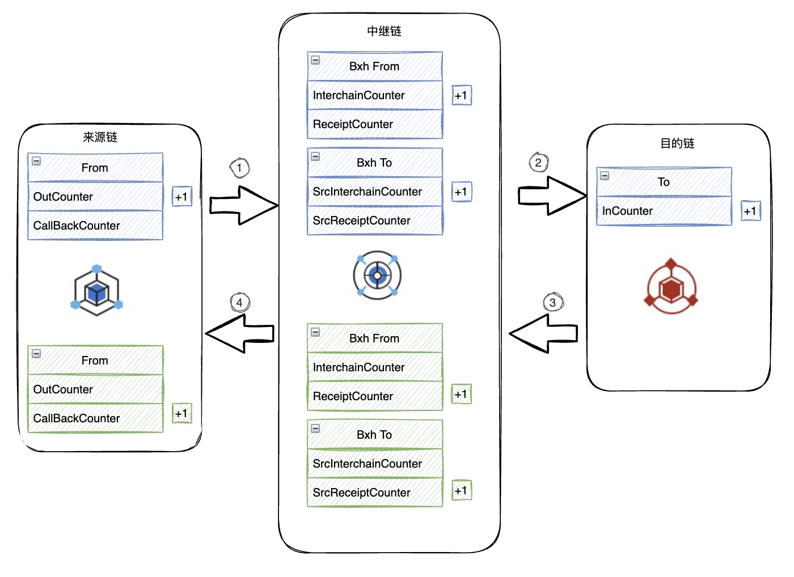
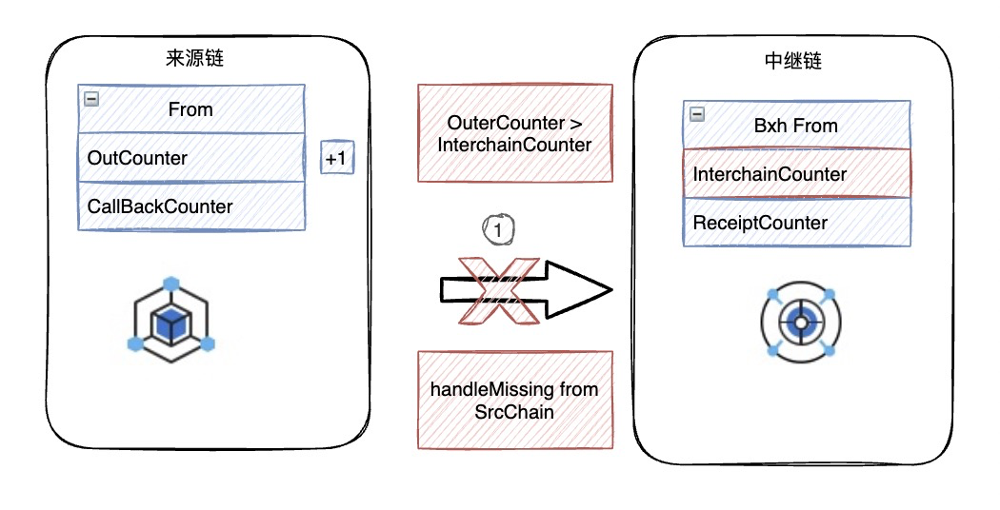
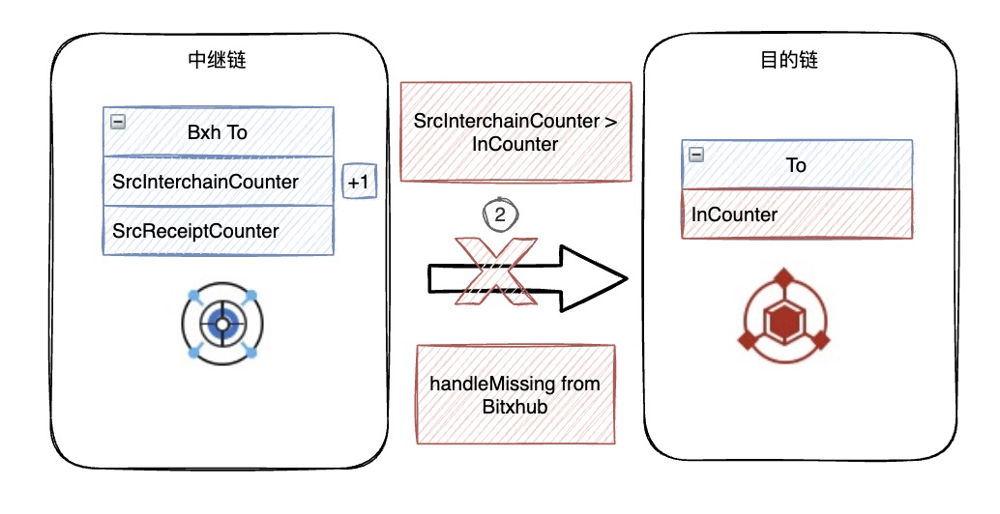
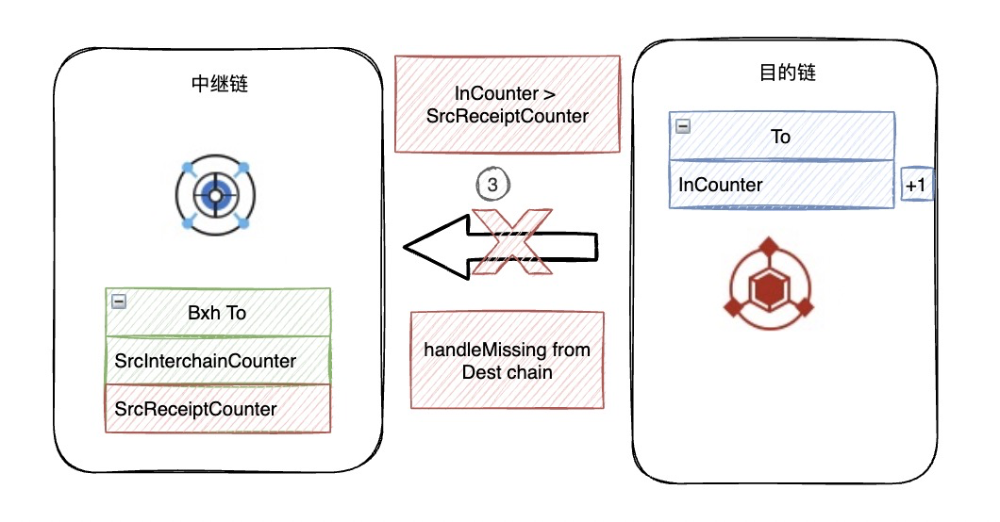
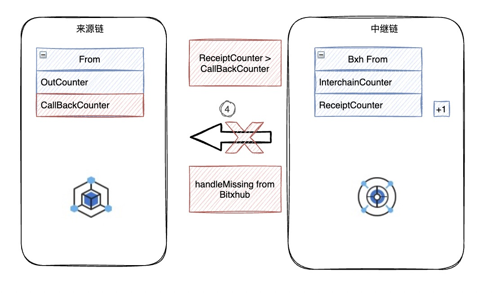
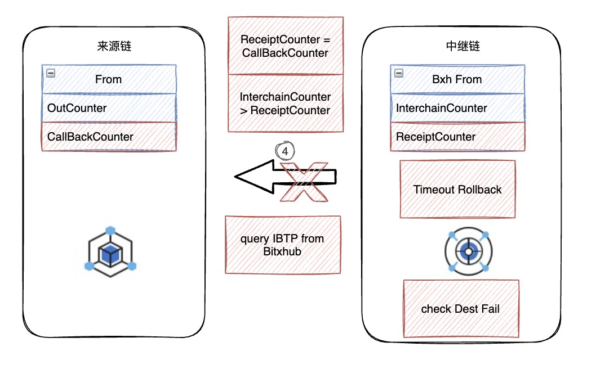

## 1. 设计方案

利用Broker合约的Counter与中继链内置合约Interchain合约的Counter维护应用链与中继链的跨链事务一致性。网关作为无状态不存储任何信息，网关重启后recovery逻辑依靠两边的Counter进行遗留交易的拉取。

## 2.Counter处理机制

**中继链counter记录数据结构：**

```go
type Interchain struct {
	// 跨链服务ID
	ID                      string
	// 作为来源服务，向不同目的服务发送的跨链交易个数
	InterchainCounter       map[string]uint64
	// 作为来源服务，收到的不同目的服务发来的回执的个数
	ReceiptCounter          map[string]uint64
	// 作为目的服务，收到的不同来源服务发来的跨链交易个数
	SourceInterchainCounter map[string]uint64
	// 作为目的服务，向不同来源服务发送的回执的个数
	SourceReceiptCounter    map[string]uint64
}
```

**Broker合约Counter记录数据结构：**

```go
contract Broker {
    // 作为来源链发出的跨链事务Interchain
	mapping(string => uint64) outCounter;
    // 作为来源链收到的跨链事务Receipt
    mapping(string => uint64) callbackCounter;
    // 作为目的链收到的跨链事务Interchain
    mapping(string => uint64) inCounter;
    // 记录最新回滚的跨链事务的index
    mapping(string => uint64) dstRollbackCounter;
    ……
}
```

### 2.1 Counter配平原则

**中继链->中继链：**

$$中继链[From]To:InterchainCounter=中继链[To]From:SrcInterchainCounter$$

$$中继链[To]From:SrcReceiptCounter=中继链[From]To:ReceiptCounter$$


**来源链->中继链：**

$$来源链To:OutCounter=中继链[From]To:InterchainCounter$$

$$中继链[To]From:SrcReceiptCounter=来源链的To:CallbackCounter$$


**中继链->目的链：**

$$中继链[From]To:InterchainCounter=目的链的InCounter$$

### 2.2 正常Counter处理机制

如下图所示，以一个具体的跨链交易为例：

1. 来源链发起一笔跨链交易，来源链的OuterCounter+1;
2. 中继链收到跨链交易，中继链的From的InterchainCounter+1， To的SrcInterchainCounter +1；目的链收到跨链交易，目的链borker合约的Incouter+1；
3. 目的链抛出回执跨链事件，中继链收到回执跨链交易，中继链的From的ReceiptCounter+1， To的SrcReceiptCounter +1;
4. 来源链收到回执跨链交易，From的CallBackCounter+1。



### 2.3 Recover机制

#### 2.3.1 中继链未收到来源链的Interchain

此时的情况是：

1. 来源链的OutCounter > 中继链[From]To:InterchainCounter；
2. 网关去来源链请求缺失的交易，来源链根据OutMessage信息还原该跨链交易；
3. 来源链重新发送至中继链，中继链[From]To:InterchainCounter与中继链[To]SrcInterchainCounter +1。则两边的Counter得到配平。



#### 2.3.2 目的链未收到中继链的Interchain

此时的情况是：

1. 中继链[To]From:SrcInterchainCounter > 目的链的InCouter；
2. 网关去中继链请求缺失的交易，中继链根据账本还原该跨链交易；
3. 中继链重新发送至目的链，目的链InCounter+1。则两边的Counter得到配平。




#### 2.3.3 中继链未收到目的链的Receipt

此时的情况是：

1. 目的链InCounter > 中继链[To]From:SrcReceiptCounter；
2. 网关去目的链请求缺失的交易，目的链根据ReceiptMessage还原该跨链交易；
3. 目的链重新发送至中继链，中继链[To]From:SrcReceiptCounter+1。则两边的Counter得到配平。



#### 2.3.4 来源链链未收到中继链的Receipt

此时的情况是：

1. 中继链[From]To:ReceiptCounter > 来源链CallBackCounter；
2. 网关去中继链请求缺失的交易，中继链根据账本还原该跨链交易；
3. 中继链重新发送至来源链，来源链CallBackCounter+1。则两边的Counter得到配平。



### 2.4  异常情况Counter处理机制

#### 2.4.1 超时回滚

如果长时间未收到目的链的回执信息，将触发超时回滚，中继链通知来源链进行回滚操作，如果此时该链路断开导致该回滚通知未收到。

此时的情况是：

1. 中继链[From]To:ReceiptCounter = 来源链CallBackCounter；
2. 中继链[From]To:InterchainCounter > 中继链[From]To:ReceiptCounter
3. 网关去中继链请求该交易，中继链根据账本还原该跨链交易；
4. 如果该交易的事务状态是正常（Begin）暂不处理，如果是待回滚（Begin_Rollback），网关将该交易重新发送至来源链；
5. 来源链根据事务状态进行回滚，回滚完毕将CallBackCounter+1。

注意，此时CallBackCounter > 中继链的ReceiptCounter，虽然没有达到配平，但是如果目的链的交易延迟到达中继链，中继链的ReceiptCounter会正常+1(根据事务状态不必将其转发至来源链)。因此最终CallBackCounter与ReceiptCounter会配平。



#### 2.4.2 目的链服务未注册

与2.4.1类似，中继链需要通知来源链进行回滚，如果此时该链路断开导致该回滚通知未收到，处理逻辑与2.4.1一致。

值得注意的是，由于中继链的InterchainCounter > ReceiptCounter，并且来源链回滚完毕后，CallBackCounter也会+1，为了让ReceiptCounter+1，中继链仍然会将交易发送至目的链。但是由于该交易目的链并未执行，因此不需要回滚。只需要将目的链的InCounter+1即可。