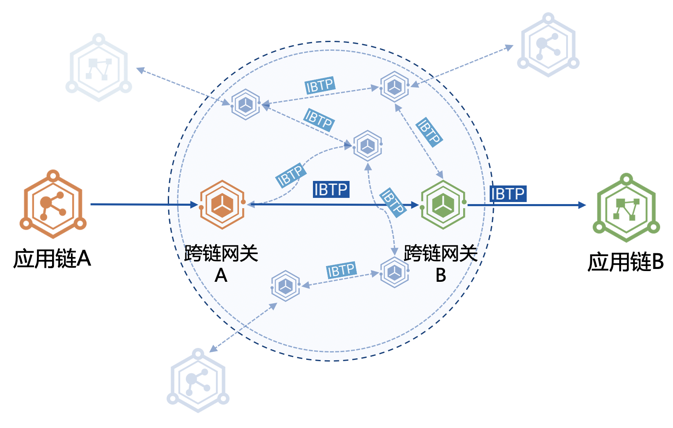
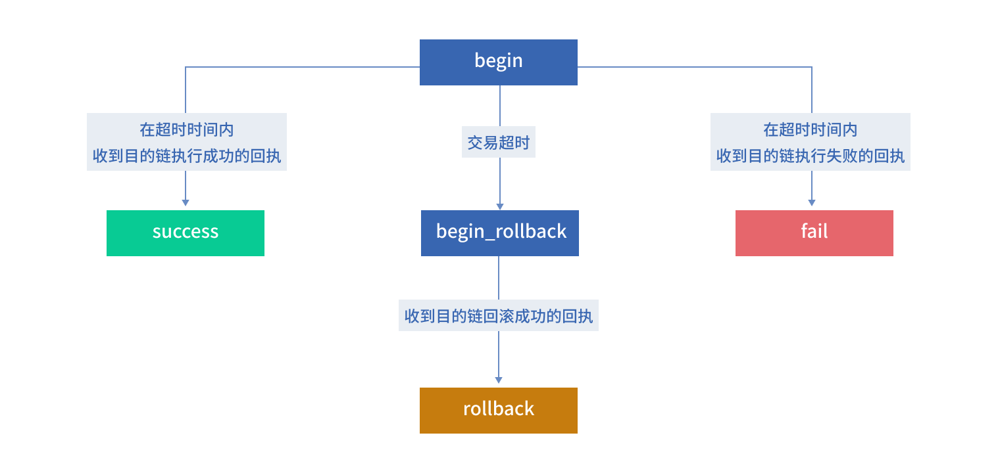

# 直连架构跨链事务方案

针对跨链参与方有信任基础或者安全性要求不那么高的场景，可以采用链对链架构，在该种架构下，不同的链通过各自的跨链网关直接相连，可以大大降低跨链设施部署成本。具体可以参考<a href="../../design/pier_design/#directMode">直连架构设计</a>

在该架构下，由于没有第三方中继链的接入，因此我们使用部署在各自应用链上的事务管理合约来实现跨链交易的事务管理。事务管理合约只能由跨链管理合约Broker合约调用，并且仅管理由该链发出的跨链交易的事务状态。

## 事务状态转换流程

Broker合约在抛出跨链事件的同时，在事务管理合约中记录该笔跨链交易的相关事务信息，在收到目的链回执后更改相应事务状态。事务状态转换图如下图所示：

### Begin -> Success

正常的跨链交易的事务状态转换流程如下：

1. Broker合约抛出跨链事件的同时，在事务管理合约中将该笔跨链交易的事务状态设置为Begin，并记录该笔跨链交易的发起时间；
2. 来源链网关收到该笔跨链交易后转发至目的链网关，目的链网关将该笔跨链交易提交至目的链执行；
3. 目的链执行成功后返回IBTP类型为IBTP_RECEIPT_SUCCESS的跨链交易回执至来源链网关；
4. 来源链Broker合约收到IBTP类型为IBTP_RECEIPT_SUCCESS的跨链交易回执后，组织业务合约执行相应回调操作并将事务管理合约中该笔跨链交易的事务状态设置为Success。

### Begin -> Fail

当目的链执行失败时，来源链Broker合约将根据跨链交易回执执行相应回滚操作，具体的事务转换流程如下：

1. Broker合约抛出跨链事件的同时，在事务管理合约中将该笔跨链交易的事务状态设置为Begin，并记录该笔跨链交易的发起时间；
2. 来源链网关收到该笔跨链交易后转发至目的链网关，目的链网关将该笔跨链交易提交至目的链执行；
3. 目的链因为各种原因执行失败后返回IBTP类型为IBTP_RECEIPT_FAILURE的跨链交易回执至来源链网关；
4. 来源链Broker合约收到IBTP类型为IBTP_RECEIPT_FAILURE的跨链交易回执后，组织业务合约执行相应回滚操作并将事务管理合约中该笔跨链交易的事务状态设置为Fail。

### Begin -> BeginRollback -> Rollback

每笔跨链交易将根据具体的业务场景携带一个超时时间信息，Pier会根据事务管理合约中记录的跨链交易事务状态以及发起时间，当跨链交易超时时触发超时回滚操作。具体参考<a href="../../design/direct_transaction/#timeoutAnchor">超时回滚机制</a>

## <a name="timeoutAnchor">超时回滚机制</a>

区块链跨链场景中，来源链某个业务发起跨链交易后，需要等待目的链执行跨链交易后返回的回执才能继续之后的业务。
如果来源链与来源链网关、来源链网关与目的链网关、目的链网关与目的链之间任意一条链路之间的网络出现故障，会导致来源链迟迟不能接收到目的链的跨链交易的回执，影响来源链上的业务的正常进行。

因此需要超时回滚机制来保障业务逻辑不被阻塞。来源链可以根据具体的业务场景设置跨链交易的超时时间，在高信任场景下，由跨链网关根据事务管理合约中记录的事务信息组织双方执行超时回滚操作。

具体实现流程描述如下：

1. 来源链业务合约抛出跨链事件，该事件中包含一个超时时间;
2. 来源链跨链网关捕获到跨链交易，首先计算该笔跨链交易是否超时;  
&nbsp; (i)若超时，则说明来源链与来源链网关这条链路之间网络出现故障，触发超时回滚，执行步骤5;  
&nbsp; (ii)若未超时，则来源链网关将该笔跨链交易发送至目的链网关，继续执行步骤3;
3. 目的链网关收到跨链交易后，将跨链交易提交至目的链执行，目的链执行结束后，生成相应的跨链交易回执发送至来源链网关;
4. 来源链网关收到跨链交易回执后，计算该笔回执对应的跨链交易是否超时;  
&nbsp; (i)若超时，则说明来源链网关与目的链网关或目的链网关与目的链的链路之间网络出现故障，触发超时回滚，执行步骤5;  
&nbsp; (ii)若未超时，则来源链网关将该笔跨链交易回执提交至链上执行，执行结束后更新事务状态，该笔跨链交易结束。  
5. 触发超时回滚后，来源链网关首先通过跨链管理合约Broker组织来源链业务合约进行回滚，回滚成功后更新该笔跨链交易在事务管理合约中的事务状态为BeginRollback，然后生成类型为IBTP_RECEIPT_ROLLBACK的IBTP发送给目的链网关;
6. 目的链Broker合约收到IBTP类型为IBTP_RECEIPT_ROLLBACK的跨链交易后，组织目的链业务合约进行回滚，并生成类型为IBTP_ROLLBACK_END类型的IBTP发送给来源链网关;
7. 来源链网关收到IBTP后提交至来源链Broker合约，此时会更新事务管理合约中的事务状态为Rollback，该笔跨链交易结束。