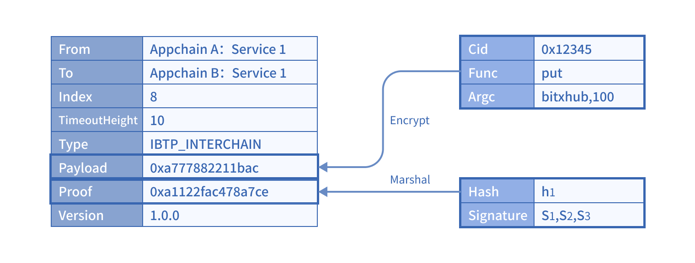

## <a name="ibtpAnchor">IBTP数据结构</a>

该协议内容指定了相关跨链事件的来源链、目的链、跨链交易方法以及验证策略、签名等诸多信息，支持应用链与中继链、应用链与应用链间的交互操作，其结构如下表所示。应用链的跨链消息通过跨链网关转换成 IBTP 结构提交至中继链，中继链通过 IBTP 内容进行跨链交易的合法性验证及可靠路由。基于 IBTP 协议跨链网关可将不同应用链抛出的事件数据格式转换为统一结构。

跨链传输协议主要围绕IBTP数据结构展开，该数据结构在跨链交易之间的流转运行基于IBTP协议的几个关键特性：跨链服务、跨链消息证明以及信任树。

| 参数          | 说明                                           |
| ------------- | ---------------------------------------------- |
| From          | 来源链ID                                       |
| To            | 目的链ID                                       |
| Index         | 跨链交易索引                                   |
| Type          | 跨链事件类型，IBTP Request类 或IBTP Response类 |
| TimeoutHeight | 跨链事件所容忍的超时块高                       |
| Proof         | 跨链交易证明                                   |
| Payload       | 跨链调用内容编码                               |
| Group         | 一对多跨链场景中同一跨链事务中其他IBTP的信息   |
| Version       | 协议版本号                                     |
| Extra         | 自定义字段                                     |

- `From`和`To`字段：分别代表来源服务和目的服务的ID，其格式为`<BXH_ID>:<AppChain_ID>:<Service_ID>`，其中：
  - `BXH ID`：来源/目的服务所在应用链接入的中继链ID，如果来源服务和目的服务所在链连接了同一条中继链，该部分可以省略；
    -  `AppChain_ID`：来源/目的服务所在应用链ID，应用链向中继链注册时由应用链管理员给出（即应用链管理员自定义），同一条中继链上各应用链ID唯一；
  - `Service_ID`：来源/目的链上服务ID，服务向中继链注册时生成，一般为服务的合约地址，同一条应用链上服务ID唯一。

- `Index`：跨链交易的索引，每一对From和To维护一个严格递增的索引值，它是中继链按序执行跨链交易的依据；
- `Type`：该字段标识IBTP类型，来源服务发到目的服务的跨链请求类型为`IBTP_INTERCHAIN`，目的服务发回来源服务的跨链回执类型可能为`IBTP_RECEIPT_SUCCESS`、`IBTP_RECEIPT_FAILURE`或`IBTP_RECEIPT_ROLLBACK`，具体由跨链交易的执行状态决定；

- `Payload`：该字段是跨链调用的内容编码，支持定向加密，根据应用链的业务需求确定；

- `Proof`：该字段存储了跨链交易证明。跨链消息证明用于验证每笔跨链交易IBTP的有效性和存在性，其内容因应用链链类型而异。对于部分应用链跨链消息证明文件较大的情况，为了保证IBTP结构精简，Proof字段也可存储跨链证明信息的哈希；
- `TimeoutHeight`：字段为IBTP在中继链上的超时块高，仅对跨链请求（`IBTP_INTERCHAIN`类型）的类型有效，该字段主要用于事务超时回滚；详见<a href="/v1.18/bitxhub/design/interchain_transaction/#txManagerAnchor">事务管理机制</a>；
- `Group`：该字段包含了一对多场景中同一跨链事务中其他IBTP的信息，关于一对多事务场景详见<a href="/v1.18/bitxhub/design/interchain_transaction/#txManagerAnchor">事务管理机制</a>；
- `VerSion`：该字段为跨链协议的版本信息；
- `Extra`：该字段可根据应用链的业务需求进行自定义扩展。

## <a name="serviceAnchor">跨链服务</a>

跨链服务是指应用链要参与跨链的业务，该服务可以是来源链上发起跨链的服务，也可以是目的链上接受跨链调用的服务。跨链服务承载着不同应用链上的具体业务执行逻辑，跨链多方基于跨链服务的业务属性进行链间互操作协同。

### 服务注册

参与跨链的应用链业务必须将自己的业务信息提交到中继链，并由中继链管理员审核通过。应用链服务注册包含以下信息：

| 字段        | 说明                                       |
| ----------- | ------------------------------------------ |
| appchain-id | 应用链ID                                   |
| service-id  | 服务ID                                     |
| name        | 服务名称                                   |
| intro       | 服务功能简介                               |
| type        | 服务类型                                   |
| ordered     | 表示该服务是否需要按序调用                 |
| permit      | 允许调用该服务的其他服务列表               |
| details     | 服务调用详情，包含服务调用名称、参数等信息 |
| reason      | 服务治理相关说明                           |

对重要参数进行详细解释：

- `appchain-id`：为应用链注册时的ID；
- `service-id`：为服务在当前应用链上的唯一ID，一般为应用链上的服务合约地址，对应IBTP ID中的第三部分；
- `name`：为服务名称，支持中文，方便用户自定义使用；
- `type`：该字段为跨链服务类型，主要有以下几类：
  - 合约调用类服务：通过目的链Broker合约进行调用，该类服务一般需要按序调用；
  - 存证类服务：直接将来源链的数据发送到目的链指定地址，该类服务一般不需要按序调用；
  - 数据迁移类服务：将来源链的交易转发到目的链，该类服务常用于同一机构两条链之间数据迁移，一般需要按序调用。

### 服务属性

跨链服务具有以下几点属性：

- 唯一确定性：一个来自来源链服务的跨链消息对目的链服务有且仅有一次调用；
- 顺序性：一个定序的服务是指跨链消息必须按照发出顺序对目的服务进行调用，一个不定序的服务是指跨链消息无需按照发出顺序对目的服务进行调用；
- 许可性：跨链服务可以设置自己允许被哪些其他跨链服务调用。

## 跨链消息证明

应用链的异构性在跨链协议IBTP数据结构的差异主要体现在Proof字段。Proof是跨链交易合法性证明的凭证，下面将从异构和同构两类应用链详细阐述IBTP结构的构建。

### 同构应用链

同构应用链含义为：作为跨链的来源链与目的链的区块、交易等数据结构相同，如都为fabric。同构应用链所构建的IBTP结构如下图所示。

以108号区块的第一个跨链交易为例，对于应用链B中地址为“0x12345”的合约，该交易调用合约方法“put”，参数为“bitxhub，100”。Proof提供Merkle路径的信息，其中Hash是跨链交易相关内容的哈希，Path是SPV路径哈希，MerkleRoot是最终的根哈希，Signature是对于根哈希的签名。

### 异构应用链

异构应用链分为两种，一种是及时确认并且交易本身有验证节点作为背书的区块链，比如Hyperchain、Fabric等；另一种是概率确认或者交易本身没有验证节点的区块链，比如比特币、以太坊等。

第一种类型的异构应用链已满足IBTP协议的构造条件，因此跨链网关只需要调用应用链的SDK即可实现IBTP的构建。上图是以Fabric为应用链的IBTP结构，其中Proof字段包含的Hash字段是Fabric中chaincode执行结果的摘要，Signature字段则是背书节点对Hash字段的签名数组，而对应的背书节点的证书信息，即应用链信任根，已经提前存储到中继链中，详见信任树。

第二种类型以以太坊为例，其本身是概率性确认的区块链，且抛出的跨链事件未携带签名信息。因此跨链交易合法性证明需要由多个跨链网关协作构造，跨链网关的可靠性通过奖惩机制进行保证。

## 信任树

信任树是中继链上维护的关于应用链注册以来的所有信任根的更变信息。

IBTP协议要求，跨链交易场景中目的应用链需要验证跨链消息的有效性。根据3.2.2.节内容可知，异构链跨链交易的验证需要结合IBTP的Proof信息和应用链的信任根信息，这个信任根信息就可以从该应用链的信任树中获取。

### 信任树内容

信任树的具体内容由应用链共识算法类型决定。对于PoW共识的应用链，其信任树为应用链连续的区块头，信任根为某一个高度的区块头；对于PoS共识的应用链，其信任树为验证人信息的变化纪录，信任根则为某一时刻的验证人集合。

### 信任树维护

应用链的初始信任根在应用链注册时存储到中继链上，后续信任根可能会发生变化，但跨链交易验证使用的信任根应当是交易发起时的应用链信任根，故IBTP协议需要中继链维护每条已注册的应用链信任树。

不同的应用链信任树通过各自的信任树智能合约来维护，即由跨链网关获取应用链信任树的变化信息并提交到中继链上，每一条已注册的应用链在接入的中继链上有唯一对应的信任树。