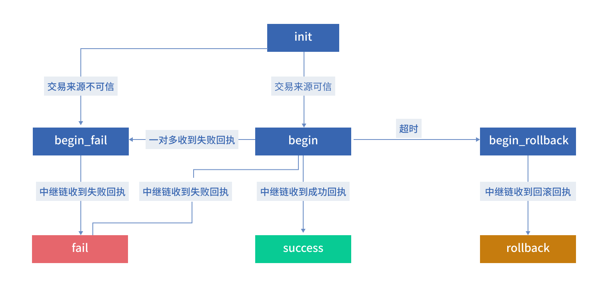
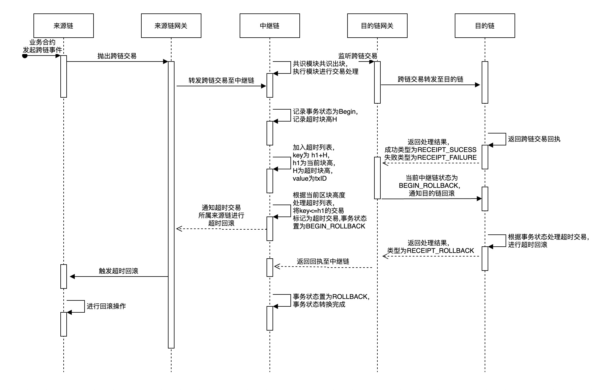

# <a name="txManagerAnchor">跨链事务方案</a>

在区块链跨链场景中，区块跨链需要保证跨链交易的原子性和一致性，即来源链和目的链上的交易要么都成功，要么都失败回滚。
现有的跨链事务处理机制大致分为两种：

- **哈希时间锁定机制**：哈希时间锁定机制(Hash Time Locked Contract，简称HTLC) 是一种去中心化、无需受信任的第三方中介的跨链原子交换协议。但是哈希锁定机制的应用场景十分受限，仅用作资产交换，并且有着严格的时间时钟上限。如果一方因为网络、设备等问题，在时钟上限内，无法完全保证跨链交易事务的原子性。
- **基于中继链的二阶段机制**：该机制需要提前冻结来源链与目的链的相关资产，根据中继链返回的事务处理结果执行或回滚。但这种方式需要在目的链执行两次交易上链。为此，中继链提供了事务管理机制，通过内置的事务管理合约，来保证不同业务场景下跨链交易的事务性。

BitXHub内置事务管理合约来实现跨链交易的事务管理，跨链事务方案具有三个特性：**一对一跨链**；**一对多跨链**；**超时回滚**。

对于一对多跨链的场景，其状态转换时需要注意子事务的状态情况：

1. 如果收到一个失败的子事务，则事务状态转换成失败；
2. 需要等所有子事务都成功，才能将事务状态转换成成功。

另外，每一次事务状态转换，中继链都需要抛出IBTP来通知应用链：

- `BEGIN`：通知目的链；
- `BEGIN_FAILURE`: 通知来源链和目的链；
- `BEGIN_ROLLBACK`：通知来源链和目的链；
- `BEGIN -> FAILURE`： 通知来源链；
- `BEGIN_FAILURE -> FAILURE`: 无需通知；
- `SUCCESS`: 通知来源链；
- `ROLLBACK`：无需通知。

## 事务状态转换流程

由于事务管理合约只针对于跨链交易，因此中继链BitXHub收到交易后判断是否是IBTP类型交易。检查IBTP是否有效，如交易字段格式检查，来源链与来源链服务、目的链与目的链服务是否注册。例如IBTP的From字段或To字段格式不合法，中继链封装IBTP不合法的相关报错信息，并构建`receipt_failed`类型的回执给跨链网关。网关捕获该错误信息后将丢弃该条不合法的跨链交易。通常事务转换如下图所示，接下来针对该图进行详细阐述。



### INIT -> BEGIN -> SUCCESS

正常的跨链交易的事务状态转换流程如下：

1. IBTP检查通过，将事务状态置为`BEGIN`，即IBTP类型为`IBTP_INTERCHAIN`，txStatus为`BEGIN`，通知目的链进行处理;
2. 目的链网关收到中继链的跨链交易后转发至目的链，目的链处理成功返回IIBTP类型为`IBTP_RECEIPT_SUCESS`的跨链交易回执至中继链。
3. 中继链收到目的链的回执后，将事务状态由`BEGIN -> SUCCESS`，事务状态转换完成，并将回执结果通知来源链。
4. 来源链收到IBTP类型为`IBTP_RECEIPT_SUCESS`，txStatus为`SUCESS`的跨链交易后，业务合约根据收到的回执内容进行相关更新操作。

### INIT -> BEGIN -> FAILURE

当目的链执行失败时，中继链将通知来源链进行回滚，具体的事务状态转换流程如下：

1. IBTP检查通过，将事务状态置为`BEGIN`，即IBTP类型为`IBTP_INTERCHAIN`，txStatus为`BEGIN`，通知目的链进行处理；
2. 目的链网关收到中继链的跨链交易后转发至目的链，目的链处理失败返回IIBTP类型为`IBTP_RECEIPT_FAILURE`的跨链交易回执至中继链。
3. 中继链收到目的链的回执后，根据`IBTP_RECEIPT_FAILURE`将事务状态由`BEGIN -> FAILURE`，事务状态转换完成，并将回执结果通知来源链。
4. 来源链收到IBTP类型为`IBTP_RECEIPT_FAILURE`，txStatus为`FAILURE`的跨链交易后，broker合约通知业务合约根据收到的回执内容进行相关回滚操作。

### INIT -> BEGIN_FAILURE -> FAILURE

目的链或目的链服务未注册，即IBTP检查报错为目的链相关错误，中继链将通知来源链与目的链进行回滚操作，具体的事务状态转换流程如下：

1. 将事务状态置为`BEGIN_FAILURE`。通知来源链和目的链进行回滚。
2. 当来源链收到txStatus为`BEGIN_FAILURE`的跨链交易时，将对其进行回滚。
3. 当目的链正常连接并注册，目的链网关将把状态为`BEGIN_FAILURE`的跨链交易发送至目的链进行回滚处理。网关插件构建的receipt同样是IBTP类型的跨链交易，IBTP的type为`IBTP_RECEIPT_FAILURE`。中继链收到目的链的回执后将事务状态置为最终状态`FAILURE`。注意此时整个失误状态已经为最终状态，标志着该跨链事务已完成。中继链将不会通知来源链与目的链。

### INIT -> BEGIN_ROLLBACK -> ROLLBACK

当中继链收到来源链交易后，将维护一个超时块高，超过超时块高将触发超时回滚，具体参考<a href="../../design/interchain_transaction/#timeoutAnchor">超时回滚机制</a>。

## 一对一跨链

当来源链业务合约发起跨链交易时，除了提供目的链的目标业务合约中要调用的方法和参数外，还可以提供来源链的回调方法和回滚方法。
来源链跨链网关捕获跨链事件封装成IBTP提交到中继链，并由中继链跨链事务合约进行处理。跨链事务合约将初始化该跨链交易所对应的跨链事务，
在跨链事务合约中以KV形式记录跨链事务ID和事务状态信息，其中跨链事务ID由**FROM || TO || IBTP index**组成，初始的跨链状态信息为`TransactionStatus_BEGIN`。

当目的链执行完跨链交易时，由目的链跨链网关得到执行的结果（成功或失败），并将该信息封装成IBTP receipt提交给中继链。
中继链跨链事务合约根据其中的回执信息，更新跨链事务ID的状态，如果成功，则状态更新为`TransactionStatus_SUCCESS`，否则为`TransactionStatus_FAILURE`。

如果跨链事务最终状态是成功，则来源链跨链网关调用来源链业务合约注册的回调函数进行回调；如果跨链事务状态为失败，则来源链跨链网关将调用来源链业务合约注册的回滚函数进行回滚操作。

## 一对多跨链

一对多跨链是指，在一个来源链的业务合约的交易中，抛出了多个指向不同目的链的跨链事件。 一对多跨链和一对一跨链的整体流程一样，只是其中事务分为全局事务和子事务的概念：

- 子事务：指来源链和某个目的链的跨链事务
- 全局事务：综合各个子事务的整体事务

因此在中继链的跨链事务合约中，为一对多跨链事务特别设计了一个事务信息结构来支持该场景下的跨链事务状态记录和更新。该结构如下：

```go
type txInfo struct {
	// 全局事务状态
	globalState string
	// 子事务信息，key为子事务ID，即各目的链的地址，value为子事务状态
	childTxInfo map<string, string>
}
```

其中，全局事务状态和子事务初始状态为BEGIN。之后，各目的链的跨链网关获取跨链交易并提交给各目的链执行，目的链执行完子事务后由跨链网关根据执行结果向中继链反馈子事务状态，中继链事务管理合约将进行相应的更新：

- 如果交易执行成功，则将对应的子事务状态设置为`SUCCESS`，当所有子事务状态均为`SUCCESS`时，跨链事务管理合约将该全局事务ID对应的事务状态更新为`SUCCESS`；

- 如果交易执行失败，则将对应的子事务状态设置为`FAILURE`，并将该全局事务ID对应的事务状态更新为`FAILURE`，

之后，各个应用链（包含来源链和目的链）的跨链网关可以获取中继链的全局事务和子事务的状态， 来对应用链进行业务上的“回调”操作或“回滚”操作。

## <a name="timeoutAnchor">超时回滚机制</a>

区块链跨链场景中，来源链某个业务发起跨链交易后，需要等待目的链执行跨链交易后返回的回执才能继续之后业务。如果目的链TPS较低，或者来源链和目的链之间的网络出现故障，会导致来源链迟迟不能接收到目的链的跨链交易的回执，影响来源链上的业务的正常进行。

采用超时回滚机制，使用中继链作为跨链双方区块链的信任中心。应用链和中继链之间通过跨链网关进行跨链事件的捕获、封装和跨链交易的转发。同时，中继链共识算法定时出块，使跨链双方有一个共同的时间标准。其具体实现流程如下：



1. 来源链业务合约抛出跨链事件，该事件中包含一个等待的区块数H；

2. 来源链跨链网关捕获到跨链事件，将跨链事件封装成中继链交易Tx提交到中继链；

3. 该交易在中继链第h个区块打包出块确认后，中继链对该跨链交易进行验证和处理，在中继链的事务管理合约中初始化该跨链交易对应的跨链事务TX，将其状态设置为`BEGIN`，将该事务加入第（h1+H）块对应的超时事务列表。同时，中继链继续定时出块并执行交易。每执行一个交易，如果该交易为跨链交易回执类型，便将其从所处的超时事务列表中删除。当执行完整个区块的交易，便会获取当前区块对应的超时事务列表，并将该列表中的所有事务的状态设置为`BEGIN_ROLLBACK`，并通知来源链和目的链网关对应用链进行回滚；

4. 中继链将该跨链交易路由给目的链，目的链跨链网关捕获到该跨链交易，将其提交给目的链进行处理；

5. 目的链执行完跨链交易后，跨链网关将交易回执封装成跨链交易回执提交给中继链；
6. 该跨链交易回执经中继链验证后，中继链会在事务管理合约中查询到该跨链交易回执对应的跨链事务TX的超时块高（h1+H），有以下两种情况：
   1. 如果此时中继链的出块高度还未超过（h1+H），则将该事务状态设置为完成状态为`FAILURE`或者`SUCCESS`，并将该事务TX从第（h1+H）块对应的超时事务列表中删除，并通知来源链获取跨链交易回执，继续步骤7；
   2. 如果此时中继链的出块高度已经大于（h1+H），且中继链发现该回执是目的链执行了业务合约所得到的，则中继链上该交易执行失败。目的链跨链网关从交易回执中得到执行失败的原因是因为中继链上该跨链事务状态已经是`BEGIN_ROLLBACK`了，会重新将原来的跨链交易提交给目的链，让目的链去回滚之前的操作，并将执行结果封装成跨链交易回执重新提交给中继链。此时中继链验证跨链交易回执后会将对应的事务状态设置为`ROLLBACK`，标志着这笔跨链事务已经结束，最终双方区块链都需要回滚业务。

7. 中继链将跨链交易回执路由给来源链，来源链网关捕获到之后提交给来源链进行后续处理，当前跨链交易结束。