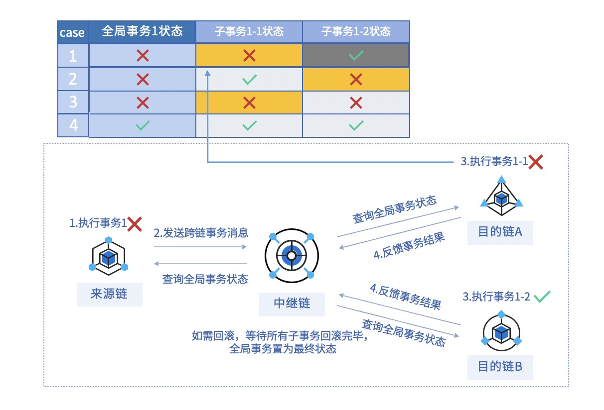
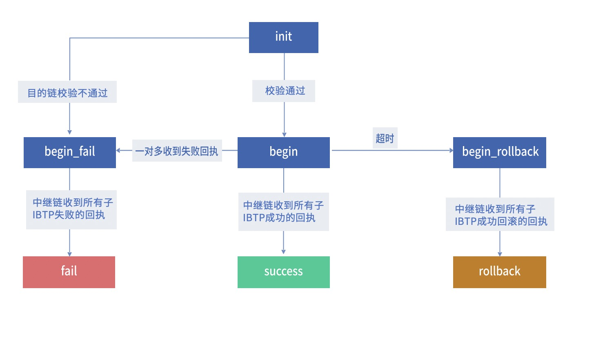
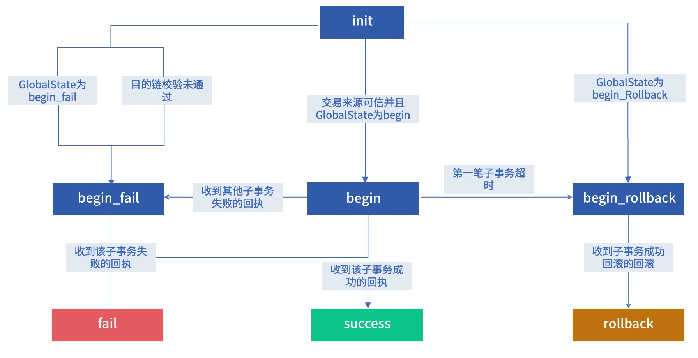

# <a name="one2multiAnchor">一对多跨链事务方案</a>

一对多跨链是指，在一个来源链的业务合约的交易中，抛出了多个指向不同目的链或不同目的链服务的跨链事件。 一对多跨链和一对一跨链的整体流程一样，只是其中事务分为全局事务和子事务的概念：

- 子事务：指来源链和某个目的链的跨链事务
- 全局事务：综合各个子事务的整体事务

两者的关系如下：

1. 全局事务状态异常 => 所有子事务均需要回滚；
2. 所有子事务状态转换为统一的最终状态 => 全局事务状态转换为最终状态；
3. 全局事务状态未达到最终状态 => 子事务状态未达到最终状态。

全局事务的异常变更将改变所有子事务状态，子事务状态异常也将变更全局事务状态：

1. 子事务状态有一笔异常 => 全局事务状态为异常；
2. 子事务状态成功，全局事务状态异常 => 所有子事务状态异常。

上图中黄色表格代表子事务触发全局事务状态由正常变为异常，事务处理如下：

1. 将全局事务与当前所收到的所有子事务置为待回滚状态；
2. 对于当前所有收到的子事务通知来源链回滚；
3. 对于当前事务通知来源链目的链回滚。

如果子事务返回成功回执结果，但此时全局事务已经为异常状态（如图中灰色的表格），针对该子事务处理如下：

1. 如果是从来源链发送的子事务，通知当前子事务来源链回滚，目的链更新事务信息；
2. 如果是从目的链发送的成功子事务回执，通知当前子事务来源链目的链回滚。

## 全局事务状态转换流程

对于全局事务状态转换图如下：

### Init -> Begin

收到第一笔正常的子IBTP，GlobalState变为Begin，超时块高为第一笔IBTP所在块高+超时块高。

### Init -> Begin_fail 

收到**第一笔子IBTP将校验所有子IBTP的目的链服务注册情况**，因此，如果其中有目的链校验不通过的情况，收到的第一笔子IBTP就将GlobalState置为待回滚状态Begin_fail，并通知来源链目的链回滚**当前的子IBTP**。

### Begin -> Begin_fail

初始状态为Begin，如果收到其中某一笔失败的回执，此时将GlobalState置为待回滚状态Begin_fail，

### Begin -> Begin_rollback

并未在超时块高达到之前收到所有子IBTP的成功回执，进入待回滚状态（Begin_Rollback），并把所有子IBTP置为待回滚状态（无论之前的子事务是否收到成功的回执）。

### Begin_fail -> Fail 

所有子IBTP均收到Receipt_Fail的回执。

### Begin -> Success

所有子IBTP均收到Receipt_Success的回执。

### Begin_Rollback -> Rollback

所有子IBTP均收到Receipt_RollBack的回执。

## 子事务状态转换流程

### Init -> Begin

校验通过，并且GlobalState为Begin，\如果没有GlobalState，说明是第一个到达的子IBTP，创建GlobalID，并将GlobalState置为Begin。

### Init -> Begin_fail

如果当前的目的链校验不通过。或者GlobalState已经为Begin_fail，此时当前的子IBTP即使校验通过，状态也必须与GlobalState一致，为Begin_fail，通知来源链与目的链回滚**当前的IBTP（因为所记录的其他IBTP已经被通知回滚了）**。

### Init -> Begin_Rollback

如果在GlobalState为Begin_Rollback后，子IBTP的Interchain才到达中继链。将由Init变为Begin_Rollback。（**TODO：check一下如果该IBTP目的链校验失败的场景）**

### Begin -> Fail

该子IBTP在目的链执行失败，返回Receipt_Fail，此时中继链的子事务状态由Begin变为Fail，GlobalState变为Begin_Fail。

### Begin -> Begin_Rollback

一般不会由子事务触发，中继链根据记录的超时块高（该超时块高开始于第一个到达中继链节点的子事务），在某个时间点触发所有的子IBTP由Begin变为BeginRollback。

### Begin_Rollback -> Rollback

中继链收到目的链类型为Receipt_RollBack的回执信息。或者收到目的链类型为Receipt_Fail的回执信息。如果所有的子IBTP都从Begin_Rollback转换为Rollback，GlobalState也从Begin_Rollback转换为Rollback。