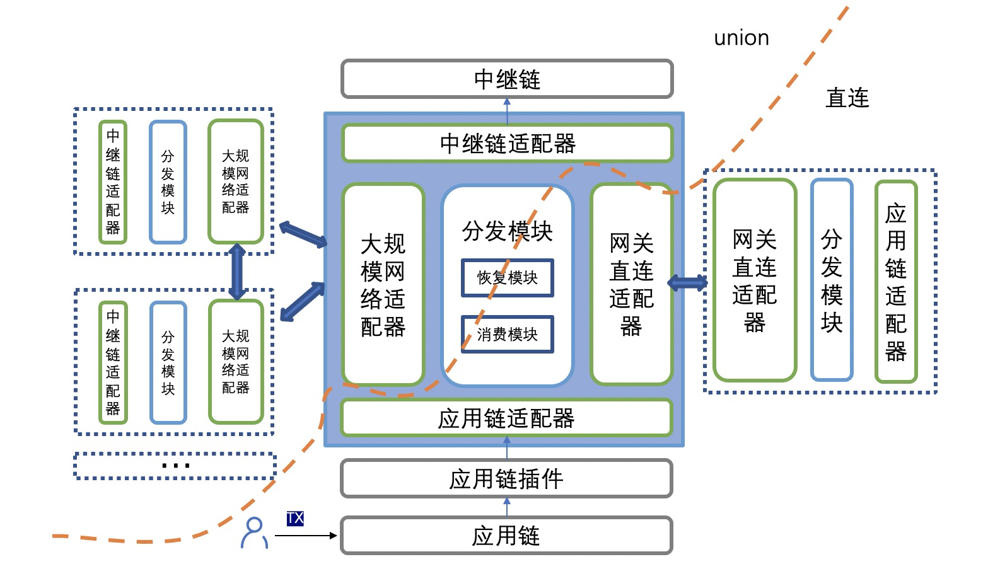
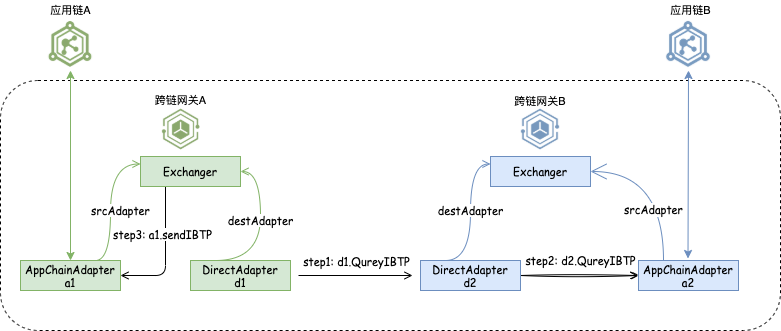
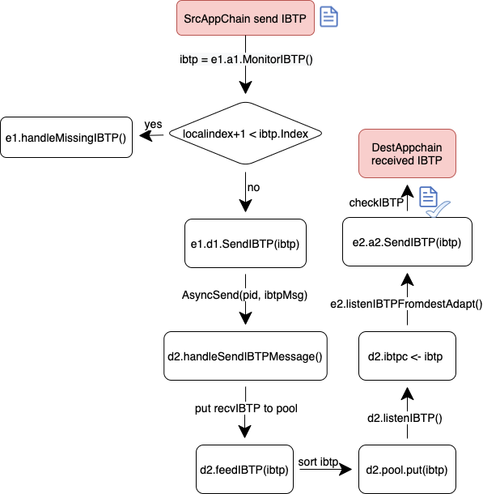
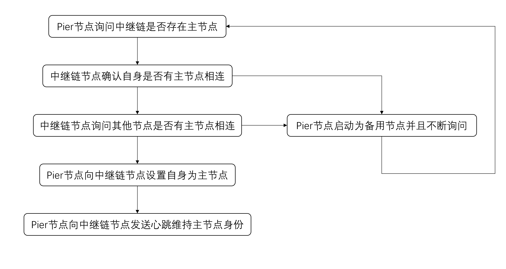
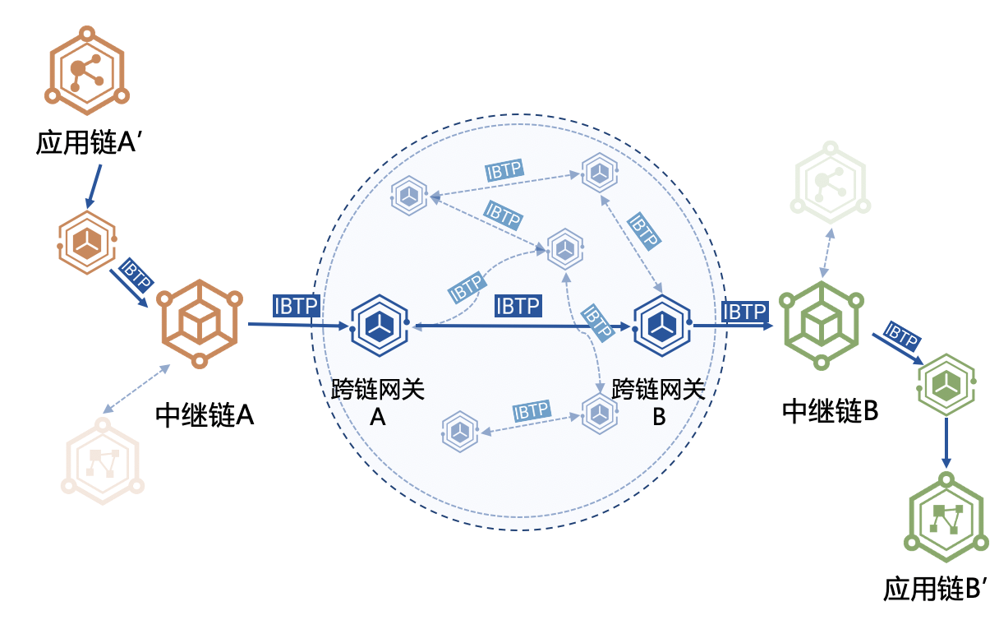
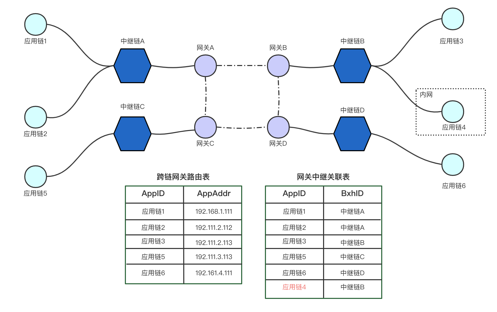
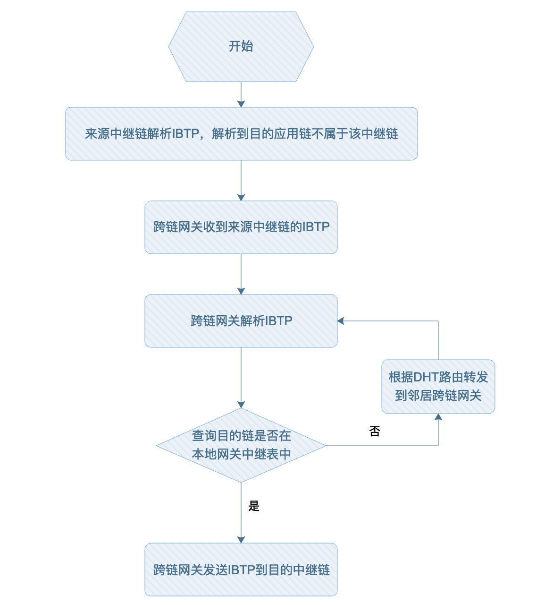
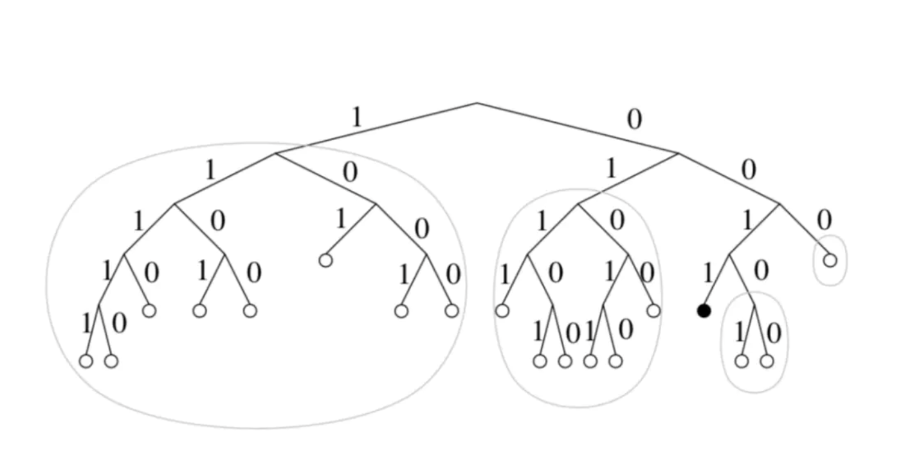

# 跨链网关设计方案

## 整体架构

在中继链的设计中，对于跨链网关的主要功能作了简要的介绍。本文主要详细介绍跨链网关的主要设计架构思想。

从跨链网关的功能上来说，设计上需要解决的难点包括以下几点：

1. 跨链网关需要对接不同架构的应用链，如何简化跨链网关接入不同区块链是跨链网关设计上需要考虑的问题。
2. 跨链网关需要支持中继模式（直接和中继链连接）、直连模式（直接和其他的Pier进行连接）和大规模网络（路由中继链之间的跨链事件），如何设计一个通用的模式匹配架构是Pier架构灵活性上需要考虑的问题。

从总体架构来说，跨链网关根据不同的功能采取了模块划分的方式，主要的功能模块有 **BxhAdapt**，**AppchainAdapt**，**Exchanger**，**DirectAdapt**( Validate Engine，Appchain Manager)，**UnionAdapt** , **Network** 等。分发模块同时只可连接两个适配器。其中应用链适配器可作为中继模式和直连模式下的srcAdapt，中继链适配器可作为中继模式下的destAdapt和union模式下的srcAdapt，网关直连适配器和大规模网络适配器则只能作为对应模式下的destAdapt。



## 处理流程

*一次完整的跨链交易处理过程如下*：

**1. AppchainAdapt监听**

跨链网关PierA启动之后，用户在Appchain A发起一笔跨链交易，AppchainAdapt模块监听到该跨链交易，将该跨链交易置于待消费IBTP通道中。

**2. Exchanger转发**

Exchanger从AppchainAdapt中收到跨链交易，作相应的有序性检查后，进行转发。转发过程中，根据跨链交易的目的链ID和服务ID以及网关的启动模式等信息，转发到正确的适配器。

- **中继链模式** ：通过中继链的SDK，提交跨链交易到中继链的内置合约上，中继链记录并执行验证，转发等操作。
- **直连模式** ：通过P2P网络连接其他跨链网关，通过跨链交易的目的链ID来转发到相应的跨链网关。

**3. Exchanger接受外部跨链交易**

- **中继链模式** ：BxhAdapt通过监听中继链上与当前应用链有关的跨链事件，Exchanger在收到IBTP后转发至AppchainAdapt进行IBTP执行。
- **直连模式** ：DirectAdapt通过P2P网络收到对方跨链网关发送的跨链交易，由Exchanger验证并转发至AppchainAdapt进行IBTP执行。

以上，就是一次完整的跨链交易的执行过程。 


## Exchanger模块设计

**模块能力**

- 提供网关启停错误恢复能力，保证服务适配器与目标适配器的交易有序性；
- 提供跨链交易事件消费能力，正确处理跨链交易过程中的服务的请求、回执、回滚等任务；

**数据结构**

| 字段              | 描述                                                      |
| ----------------- | --------------------------------------------------------- |
| mode              | 网关模式                                                  |
| srcChainId        | 服务对象的应用链id。大规模下则没有srcChainId              |
| srcBxhId          | 服务对象的中继链id                                        |
| srcAdapt          | 网关服务对象（中继/直连模式下的应用链，大规模下的中继链） |
| destAdapt         | srcAdapt提供对等服务的适配器                              |
| adapt0ServiceMeta | 初始化为从srcAdapt获取的服务meta信息                      |
| adapt1ServiceMeta | 初始化为从destAdapt获取的服务meta信息                     |

**启动流程**


- 从srcAdapt中获取可用服务列表；
- 中继/直连模式下获取应用链的可用服务列表；
- 大规模模式下获取托管中继链中该中继链注册服务之外的所有服务列表；
- 分别从两个adapt中填充服务列表下的serviceMeta信息；
- 执行recover流程抹平srcAdapt和destAdapt的ServiceMeta；
- 启动双端ibtp消费。


**恢复流程（中继模式：src-应用链，dest-中继链）**

1. 处理src -> dest

- 遍历应用链Adapt下Interchain的所有服务，处理两种遗漏交易：
    - 应用链作为来源链未发出的请求；
    - 应用链作为目的链未发出的回执；

- 抹平index差距中的所有ibtp后将dest的InterchainCounter和SourceReceiptCounter与src对齐。

2. 处理dest -> src

- 遍历中继链Adapt下Interchain的所有服务，处理三种遗漏交易：
    - 应用链作为目的链未收到的请求；
    - 应用链作为来源链未收到的回执；
    - 应用链作为来源链未收到的rollback；

- 抹平index差距中的所有ibtp后将src的SourceInterchainCounter和ReceiptCounter与dest对齐。

最终得到两份一致的ServiceMeta。在消费过程中两边ServiceMeta不需要保证一致，仅由ibtp发送成功后触发维护。

**<a name="unionRecoverAnchor">恢复流程</a>（union模式：src-中继链，dest-unionAdapt）**

将当前中继链未发送出去的 **跨链交易** 和 **跨链回执** 发送给目的中继链的union pier，或者从其他中继链的union pier请求未收到的 **跨链交易** 和**交易回执**。

BitXHub需要新增以下接口，具体流程如下：

```go
// interchain管理内置合约增加获取所有service ID的方法
func GetAllServiceIDs() []string


// 应用链管理合约增加获取所有已注册的中继链ID的方法
func GetBitXHubChainIDs() []string
```

1. 获取当前BitXHub上所有已注册的其他BitXHub信息；
2. 获取当前BitXHub上所有服务ID，针对每一个服务S0，执行以下操作 ：
     - 获取服务的interchain信息；
     - 遍历InterchainCounter（当前bitxhub服务作为来源服务）和SourceReceiptCounter（当前bitxhub服务作为目的服务），找出对手服务不在当前BitXHub的服务，并根据不同的已注册的BitXHub将对手服务信息以bxhID为粒度分割；
     - 针对每一个已注册的BitXHub，请求目标union pier的对手服务S1的interchain信息，如果失败则跳过，每获取到一个S1的信息，就进行下一个步骤；
     - 当前union pier的Service Pair Interchain SP0和每一个目的union pier的Service Pair Interchain SP1进行对比：
         - 如果SPI0.InterchainCounter > SPI1.SourceInterchainCounter，则向对应的union pier发送IBTP，如果发送失败，无需重试，因为目标union pier可能处于异常状态，一旦它重启，会主动发起请求；
         - 如果SPI0.ReceiptCounter < SPI1.SourceReceiptCounter，则向对应的union pier请求回执，如果请求回执失败，无需重试，因为目标union pier可能处于异常状态，一旦它重启，会主动发送回执；
         - 如果SPI0.SourceInterchainCounter < SPI1.InterchainCounter，则向对应的union pier请求IBTP，如果请求失败，无需重试，因为目标union pier可能处于异常状态，一旦它重启，会主动发送IBTP；
         - 如果SPI0.SourceReceiptCounter > SPI1.ReceiptCounter，则向对应的union pier发送回执，如果发送回执失败，无需重试，因为目标union pier可能处于异常状态，一旦它重启，会主动请求回执。
3. 向网络广播BitXHub Chain ID。

**消费流程**

1. 消费srcAdapt生产的ibtp：

   - 监听ibtp后识别它的from链是否为srcAdapt的（应用链/中继链）id，这里中继/直连模式下ibtp.from.chainId和srcChainId匹配， 大规模模式下ibtp.from.bxhId和srcBxhId匹配。分为两种情况：

       - 匹配正确：则为srcAdapt作为来源链发出的请求交易；

       - 匹配失败：则为srcAdapt作为目的链发出的回执信息。

   - 获取该ibtp交易服务对下对应的srcAdapt的index信息；
   - 对比ibtp所在的index和exchanger维护的index，分为三种情况:（**中继模式，union下不检查**）
       - index >= ibtp.index : 忽略
       - index < ibtp.index -1 : 处理遗失交易，传递**区间信息、交易方向、服务对、是否请求**这四种参数
       - index = ibtp.index -1 : 提交ibtp至destAdapt，成功后抹平ibtp.index和index信息

2. 消费destAdapt生产的ibtp：

   - 监听ibtp后识别它的from链是否为srcAdapt的（应用链/中继链）id，这里中继/直连模式下ibtp.from.chainId和srcChainId匹配， 大规模模式下ibtp.from.bxhId和srcBxhId匹配。分为两种情况：
       - 匹配正确：则为srcAdapt作为来源链收到的回执信息 或 作为来源链收到的rollback信号；
       - 匹配失败：则为srcAdapt作为目的链收到的请求交易。
   - 获取该ibtp交易服务对下对应的destAdapt的index信息；
   - 对比ibtp所在的index和exchanger维护的index，分为三种情况:（**中继模式，union下不检查**）
       - index >= ibtp.index : 忽略；
       - index < ibtp.index -1 : 处理遗失交易，传递**区间信息、交易方向、服务对、是否请求**这四种参数；
       - index = ibtp.index -1 : 提交ibtp至srcAdapt，成功后抹平ibtp.index和index信息；

## Adapt接口设计

pier在中继、直连、大规模三种模块下可以与不同的对象进行连接：

1. 中继模式：appchain -> 中继链；
2. 直连模式：appchain -> direct pier；
3. union模式：中继链 -> union pier。

每种对象都需要相应的适配器进行托管并实现以下通用的接口。

```go
type Adapt interface {
	// Start starts adapt
	Start() error
	// Stop stops adapt
	Stop() error
	// Name get adapt name
	Name() string
	// ID   get adapt ID
	ID() string

	// MonitorIBTP listen on ibtp from dest chain
	MonitorIBTP() chan *pb.IBTP

	// QueryIBTP query ibtp by id and type, contain multi_sign
	QueryIBTP(id string, isReq bool) (*pb.IBTP, error)

	// SendIBTP check and send ibtp to dest chain
	SendIBTP(ibtp *pb.IBTP) error

	// GetServiceIDList relay/direct: AppChainAdapt, union:BxhAdapt
	GetServiceIDList() ([]string, error)

	// QueryInterchain  queryInterchain from dest chain
	QueryInterchain(serviceID string) (*pb.Interchain, error)

	// MonitorUpdatedMeta monitor validators change or block header change from AppChain on relay mode
	// 中继/直连模式监听appchain，bxh，union模式监听bxhAdapt
	MonitorUpdatedMeta() chan *[]byte

	// SendUpdatedMeta send validators change or block header change to bitXHub on relay mode
	// 中继模式发送给appchain，bxh，直连模式发送给DirectAdapt，appchain，union模式发送给unionAdapt
	SendUpdatedMeta(byte []byte) error
```


### BxhAdapt 模块

BxhAdapt不再维护index相关的信息，由Exchanger统一进行维护。还有一点需要注意的是，该adapt可能作为中继模式下的destAdapt也可作为union下的srcAdapt，它需要满足以下的几个功能点：

1. 通过go-sdk插件监听中继链上的跨链交易；
2. 提供查询IBTP的接口（根据ibtp id和交易方向）；
3. 提供查询中继链上跨链交易Meta信息的接口（根据应用链完整服务id）；
4. 提供获取中继链上已注册的所有服务id（仅供**大规模跨链**使用）；
5. 提供执行ibtp方法。

### AppchainAdapt 模块

AppchainAdapter是适配应用链的adapter，主要功能是监听应用链的跨链交易以及向应用链提交跨链交易或者跨链交易回执。

AppchainAdapt的数据结构设计如下：

```go
type AppchainAdapter struct {
	// 应用链配置信息
	config       *repo.Appchain
	// 实现应用链插件接口的客户端
	client       plugins.Client
	// 应用链插件客户端
	pluginClient *plugin.Client
	// 检查模块：对从其他链收到的IBTP进行
	checker      checker.Checker
	// 加解密模块：对IBTP payload中content的加解密
	cryptor      txcrypto.Cryptor
	// 日志
	logger       logrus.FieldLogger
  // 监听应用链插件抛出的跨链交易通道
  ibtpC				  chan *pb.IBTP
	// 应用链ID
	appchainID   string
	// 应用链所连接的BitxHub的ID，如果是直连模式，改值为空
	bitxhubID    string
}
```

Checker模块是验证对方链IBTP的模块，其主要接口定义如下：

```go
type RuleMgr interface {

	// 检查IBTP ID是否合法，以及是否是到本链的IBTP
	BasicCheck(ibtp *pb.IBTP) (bool, error)

	// 直连模式用于验证IBTP的proof
	CheckProof(ibtp *pb.IBTP) error
}
```


### UnionAdapt 模块

 **重启恢复**

见Exchanger模块<a href="../../design/pier_design/#unionRrecoverAnchor">union模式恢复流程</a>。

 **消费流程**

- Exchanger从当前中继链捕获到发送至外部BitXHub服务的IBTP时：
    - 根据目标BitXHub Chain ID查询对应的pier。如果查询不到或者查询到但连接失败，无需重试，目的union pier重启时会主动请求；
    - 从当前BitXHub获取多签，将多签信息和IBTP一起发送给目标BitXHub的union pier，发送失败无需重试，目的union pier重启时会主动请求；

- Exchanger从UnionAdapt收到发送至当前BitXHub服务的IBTP时：
    - 需要对IBTP进行index检查，如果IBTP的index小于期望的index，忽略该IBTP，如果大于期望的index，则向来源union pier请求遗漏的IBTP。

**服务设计**

UnionAdapt需要提供给Exchanger的服务，部分功能来自于与Router的整合：

1. MonitorIBTP：监听其他union pier发来IBTP
2. QueryIBTP：Exchanger向指定union pier（包含在IBTPID中）请求指定IBTP ID和类型的IBTP，则向对应union pier发起查询IBTP
3. QueryInterchain：其他union pier请求当前BitXHub向对方BitXHub发出去的跨链请求的interchain：向中继链查询interchain，并发送给对方
4. SendIBTP：Exchanger将从bxhAdapt监听到的对外IBTP后转发至unionAdapt
5. Broadcast：向DHTManger广播当前bxhID

UnionAdapt需要处理来自其他union pier的网络请求，需要使用的消息类型：

```go
// union pier发送IBTP至当前bitxhub
Message_ROUTER_IBTP_SEND        Message_Type = 31
// union pier获取当前bitxhub的IBTP
Message_ROUTER_IBTP_GET         Message_Type = 32
// union pier获取当前bitxhub的IBTP_receipt
Message_ROUTER_IBTP_RECEIPT_GET Message_Type = 33
// union pier获取当前bitxhub服务的interchain信息
Message_ROUTER_INTERCHAIN_GET   Message_Type = 34
// 获取union模式下pier连接的bitxhubID地址
Message_CHAINID_GET             Message_Type = 35
// union pier发送最新的验证人变更至当前bitxhub
Message_ROUTE_UPDATED_META      Message_Type = 36
```

1. `Message_ROUTER_IBTP_SEND`：对应MonitorIBTP，在unionAdapt收到ibtp后塞入供exchanger消费的通道中；
2. `Message_ROUTER_IBTP/RECEIPT_GET`：对应QueryIBTP，unionAdapt收到ibtp查询请求时需通过bxhAdapt查询需要的ibtp返回给对手pier；
3. `Message_ROUTER_INTERCHAIN_GET`：对应QueryInterchain，其他union pier请求当前BitXHub查询服务的interchain信息，同样需要从bxhAdapt中获得；
4. `Message_ROUTE_UPDATED_META`：对应MonitorUpdatedMeta，在unionAdapt收到对方中继链验证人变更后塞入变更通道中供exchanger消费。


### DirectAdapt 模块

**概述**

DirectAdapt模块需要实现Adapt接口，主要负责直连模式下与AppchainAdapt、Exchanger协作。一个简单的发送ibtp的过程如图所示：






1. 来源链的AppChainAdapter(a1)通过MonitorIBTP()监听到来源链发送的IBTP，由exchanger(e1)的`listenSrcAdapt()`进行处理；
2. e1将对index进行判断，index不符合要求将进行`handelMissingIBTP()`操作，将来源链与目的链的index配平；
3. e1将ibtp交由directAdapter(d1)，直连模式下d1与其他的directAdapter通过PeerMgr网络通信。通过解析ibtp的Type字段进行寻址，由于SendIBTP是非阻塞IO请求，故采用`AsyncSend()`的方式。

```go
// SendIBTP send ibtp to another pier
func (d *DirectAdapter) SendIBTP(ibtp *pb.IBTP) error {
	data, err := ibtp.Marshal()
	if err != nil {
		panic(fmt.Sprintf("marshal ibtp: %s", err.Error()))
	}
	msg := peermgr.Message(pb.Message_IBTP_SEND, true, data)


	var dst string
	// if ibtp type is not interchain, dst adr is From
	if ibtp.Type == pb.IBTP_INTERCHAIN {
		dst = ibtp.To
	} else {
		dst = ibtp.From
	}


	if err := d.peerMgr.AsyncSend(dst, msg); err != nil {
		d.logger.Errorf("Send ibtp to pier %s: %s", ibtp.ID(), err.Error())
		return err
	}
	d.logger.Debugf("Send ibtp success from DirectAdapter")
	return nil
}
```

1. 目的链的Pier收到msg将根据msg类型调用相应的handeler，针对`pb.Message_IBTP_SEND`的handeler代码如下所示：

```go
func (d *DirectAdapter) handleSendIBTPMessage(stream network.Stream, msg *pb.Message) {
	go func(msg *pb.Message) {
		ibtp := &pb.IBTP{}
		if err := ibtp.Unmarshal(peermgr.DataToPayload(msg).Data); err != nil {
			d.logger.Errorf("Unmarshal ibtp: %s", err.Error())
			return
		}
		defer d.timeCost()()
		defer d.lock.Unlock()


		d.lock.Lock()
		// make sure the ibtpC's index is incremented
		if ibtp.Index > d.maxIndex {
			d.ibtpC <- ibtp
			d.maxIndex = ibtp.Index
		} else {
			// if receive smaller index, put it in the ibtpCache
			d.ibtpCache.Add(ibtp.Index, ibtp)
		}
	}(msg)


}
```


本地维护maxIndex记录当前收到的最大的index。

- 当收到ibtp时，判断index与本地maxIndex大小关系，如果比本地maxIndex大，将其放入ibtcC通过正常流程由Exchanger监听并处理。
- 如果index较小将其放入ibtpCache，其目的是，当Exchanger对ibtp进行处理时，由于网络传输原因可能无法按序到达，当一个较大index先于较小index到达时，较小的index将存储到本地ibtpCahce中，当exchanger执行handelmissing操作时，direct adapter无需通过网络向对面pier QueryIBTP。以减少在高并发下，由于网络传输到达先后顺序混乱而导致的频繁的网络开销`handelMissingIBTP()`。

需要注意的几点是：

1. 与中继模式的BxhAdapt类似，DirectAdapt也不需要维护index，index的维护及由于index不同所导致的handlemissing、recover等操作交由Exchanger判断。其中Exchanger模块将根据DirectAdapt模块的SendIbtp()所返回的错误类型来判断是否需要重试。而直连模式下的验证规则部署到应用链中，所以VerifyProof工作交由AppChainAdapter完成。

```go
type DirectAdapter struct {
	maxIndexMap        sync.Map
	// 记录不同来源链服务发起的最大的IBTP index
	maxIndexReceiptMap sync.Map
	// 记录不同目的链服务发起的回执类型最大的IBTP index
	logger          logrus.FieldLogger
	// 日志模块
	ibtpC           chan *pb.IBTP
	// 监听对方跨链网关发来的跨链交易
	peerMgr         peermgr.PeerManager
	// 网络模块，用于网关之间p2p连接
	appchainadapt   adapt.Adapt
	// 与应用链连接的模块
	lock            *sync.Mutex 
	// 锁机制，用于解决并发问题
	sendIBTPCounter atomic.Uint64
	// 
	sendIBTPTimer   atomic.Duration
	ibtps           sync.Map
	// 缓冲池map，用于标记不同服务的ibtp缓冲池
	appchainID      string
	// 应用链ID
	remotePierID    string
	// 连接的对方的pierID
	gopool          *pool
	// ibtp缓冲池
}
```

**PeerMgr设计**

与中继模式下的BxhAdapter不同，DirectAdapt通过PeerMgr通信，所用到的消息类型有：

```go
// pier message
// 获取应用链id
Message_APPCHAIN_GET            Message_Type = 33
…………

// 获取InterchainIndex
Message_INTERCHAIN_META_GET     Message_Type = 41
// 构造ibtp
Message_IBTP_GET                Message_Type = 42
// 发送ibtp
Message_IBTP_SEND               Message_Type = 43

…………

// 获取直连模式下pier连接的应用链地址
Message_ADDRESS_GET             Message_Type = 51

…………

// CallBack
Message_ACK                     Message_Type = 61
```

1. `Message_APPCHAIN_GET`：在启动DirectAdapter后需要获取对方的应用链地址（appChainID），收到消息后Pier的DirectAdapter获取AppChainAdapter的appChainID。
2. `Message_INTERCHAIN_META_GET`：获取对方的interchainMeta，通过AppChainAdapter的`QueryInterchain()`接口获取应用链的Counter信息。
3. `Message_IBTP_GET`   ：采用Send()接口阻塞等待对方应用链发送ibtp，对方Pier收到该消息后将调用AppChainAdapter的`QueryIBTP()`接口向应用链查询ibtp并返回，返回的ibtp通过`Message_ACK`方式进行CallBack。
4. `Message_IBTP_SEND `：将ibtp发送到对方的DirectAdapter，收到后将该IBTP放入到缓存池中，缓存池对index进行排序，以减少Exchanger的handleMissingIBTP造成的开销。DirectAdapter在启动后监听缓存池中的IBTP，将其放入到ibtpC中。
5. `Message_ADDRESS_GET`：在启动DirectAdapter时，将维护一个<PID，ChainID>的map，Pid为网络连接的标识，Pier需要清楚Pid所对应的ChainID。

在启动Pier的PeerMgr之前，需要进行对应消息类型的handler注册，在注册完所有可能用到的消息类型的最后，启动peerMgr。**各handeler具体实现可基于原来的代码进行改造。**

**handleMIssingIBTP流程**

启动Exchanger后，以下两种场景将触发handleMissingIBTP操作：

1. **监听时进行index检查**：Exchanger负责监听srcAdapter与destAdapter收到的ibtp，由于DirectAdapter通过网络传输，虽然通过缓存池的形式保证了有序性，但可能会有遗漏的IBTP，不能保证连续性。因此Exchanger需要判断index是否相等。
2. **recover阶段**：在网关启动（重启）时进行recover，进行两边index检查和handleMissing的操作。

## 主备模块设计

在新的设计中，主备高可用将会成为一个单独的模块，并且在Pier的配置文件中移除主备节点编号的配置项，改为再主备节点启动时随机生成序号的方案。需要满足以下的几个功能点：

1. 能够在启动时自主发现自己是主节点还是备用节点
2. 备用节点能够在主节点宕机的情况下主动升级成为主节点，继续完成跨链请求
3. 主备节点之间不会互相干扰，不会出现跨链交易的重复执行

**流程图**



**接口设计**

```go
type HAMng interface {
	Start() error // 启动Pier的主从模式


	Stop()  error // 停止Pier的主从模式


	IsMain()  <-chan bool // 判断是主几点还是备用节点
}
```

**错误处理**

1. **同时有两个主节点：**

- 如果主备两个节点同时连接中继链的一个节点，同时有两个主节点的错误不会产生；
- 如果主备两个节点连接中继链的两个不同节点，有极低概率产生同时有两个主节点的错误。

**解决方案**：针对该问题，新的设计将会在中继链节点收到广播询问后查询本地的主节点列表通道，如果有通道请求将会返回已有主节点的回复，并且缓冲回复给Pier，让Pier的主备节点发起新一轮的竞争。

2. **随机生成的ID重合：**

如果网关启动时随机生成的ID重合可能会导致有两个主节点启动在网络中。

**解决方案**：重启Pier避免ID的重合。

## 插件设计

**概述**

由于现在采用区块链服务的各种应用可能在使用多种不同架构的区块链，所以如果跨链平台想要获得对接各种区块链的跨链能力的话，必然使得适配异构区块链的部分过于复杂。

为了简化跨链网关对于不同架构的区块链的适配工作，我们将所有直接和应用链直接交互的部分抽象到Plugin中，Plugin为跨链网关提供必要的查询应用链状态、提交跨链交易到应用链等服务的接口，做到了对于应用链本身架构复杂性对于跨链网关是透明的。

Plugin模式的一大特点是将Pier与应用链的交互模块和Pier核心模块进行解耦，从而方便更多的应用链加入跨链系统中。Plugin作为一个和Pier相对独立的一个模块，是通过Pier运行时外部启动服务的方式进行使用。为了能实现与应用链的交互能力，Plugin需要根据不同区块链的机制具体实现特定的接口。接口需要满足以下几个功能：

- 监听相应区块链上的跨链事件并传递给Pier处理；
- 执行来自于其他区块链的跨链请求；
- 能够查询相应区块链上跨链交易相关的元数据。
- 能够查询执行跨链交易和跨链请求的历史数据

总的来说，采用Plugin机制的优势有如下两点：

- 方便更新，能够在不停止Pier的方式下更新Plugin；
- 方便适配不同的区块链，而不用改动Pier。

**Plugin接口设计**

为了减少Pier core和应用链之间的耦合，我们设计了Plugin的统一的接口，Plugin主要为Pier core提供向应用链的状态查询和资源调用的接口。具体的接口和说明参考[应用链插件编写](../../dev/plugin/)。

由于不同类型的区块链在架构上的不同，具体实现上述的接口必然有所不同，我们没发从代码层面仔细介绍，但是能够大概介绍一下Plugin的实现的思路。

在我们的设计中，跨链网关和Plugin之间涉及到跨链交易的接口都是通过IBTP来交互的，跨链网关不需要关心在应用链上跨链请求不同的数据格式，需要处理的都是IBTP Package。所以在实现Plugin上也需要围绕IBTP Package作出一定的适配。总的来说具体需要做到如下的几点：

1. 监听应用区块链上的跨链事件，并传递给Pier core进行处理。这个一般可以通过订阅区块链的事件的功能来做到。需要注意的是，Plugin需要负责跨链事件到IBTP Package的转换。Plugin重要的特点之一就是屏蔽了底层应用链不同数据格式之间的复杂性，向Pier core提供了统一的IBTP Package的数据结构，这对于Pier core的处理来说更加便捷。
2. 提供查询应用链跨链合约维护的跨链Meta信息接口。Pier本身是不保存跨链交易的状态信息的，需要长时间存储的跨链交易记录信息都应该在中继链和应用链上进行记录。所以Pier无论什么时候都应该可以从宕机等情况中恢复，恢复的过程也正需要这些接口进行查询。
3. 提交其他链上来的跨链请求。这一步是监听本应用链跨链请求的逆操作，但是Plugin和Pier core在交互上都应该是IBTP格式的Package，所以这部分功能中，Plugin需要解开IBTP package，转化为应用链可以识别的数据结构，在提交到跨链合约上进行执行。同时对于跨链交易可能的执行出错，Plugin也应该提供一定的错误处理能力。对于执行的结果，也需要为Pier core 提供统一的Response数据结构。


## 大规模跨链

 **概述**

现有的跨链网络分为 **中继链+跨链网关** 模式和 **跨链网关直连** 模式，如果要组成大规模混合跨链网络的万链互连系统，就需要跨链网关添加 **分布式哈希表DHT** 和 **跨链交易路由** 的功能。



**跨链交易路由流程：**

1. 中继链A中应用链A‘抛出跨链事件，目的链是中继链B中的应用链B’。
2. 应用链A‘的跨链网关收到跨链事件，发送IBTP给中继链A，中继链A验证跨链交易的有效性，验证成功后将该笔交易打包出块。
3. 跨链网关A解析中继链A的区块，解析到IBTP的目的链不属于中继链A管理的应用链，s随后跨链网关A根据DHT路由到目的中继链B的跨链网关B。
4. 跨链网关B’收到IBTP，将跨链交易发送到相应的中继链。
5. 中继链B验证跨链交易的有效性，验证成功后将该笔交易打包出块。
6. 应用链B‘的跨链网关同步中继链B的区块，收到中继链B‘路由的跨链交易，发送给应用链B’执行跨链交易。

**难点**

1. 如何证明来源链的跨链交易在来源中继链确实执行上链，也就是证明IBTP的存在性和有效性，SPV，中继链节点多重签名？
2. 应用链的Pier部署在内网中，DHT没有Pier相关的节点信息，如何将IBTP转发到目的中继链上。NAT，转发到目的中继链其它Pier？
3. 如何将中继链多个节点抽象成一个资源，如何确定唯一标识。DID？

**详细设计**

在大规模跨链网络中，网络拓扑图如下：




### 路由传输

每个跨链网关维护两个表，一个为**跨链网关路由表(PTable)**，记录应用链ID和应用链网络地址的关联关系，具体实现为DHT，如下表所示：

| AppID                                      | AppAddr                                                      |
| ------------------------------------------ | ------------------------------------------------------------ |
| 0xe6f8c9cf6e38bd506fae93b73ee5e80cc8f73667 | /ip4/111.132.1.111/quic/5001/p2p/QmZZFk1Tj6p25ecz98SpyHxb6joDPxR3wVPptDwuc8fue1 |
| 0x8374bb1e41d4a4bb4ac465e74caa37d242825efc | /ip4/171.132.1.131/quic/4002/p2p/QmNRgD6djYJERNpDpHqRn3mxjJ9SYiiGWzExNSy4sEmSNL |

另一个本地缓存的**网关中继关联表(PBTable)**，记录应用链ID和中继链的关系。如下表所示：

| AppID                                      | BxhID |
| ------------------------------------------ | ----- |
| 0xe6f8c9cf6e38bd506fae93b73ee5e80cc8f73667 | bxhA  |
| 0xe1sdddcf6e38bdxxxae93b73ecscs0cc8f73112  | bxhA  |

**种子节点：**由每个接入到路由网络的跨链网关维护，如上图种子节点可以是PierA和PierB**。**

**Pier新增：**

1. Pier连接到中继链，中继链路由模块发生Add Pier动作后，将所属中继链管理的所有应用链信息广播给所属的Pier，Pier构造本地的**网关中继关联表**；
2. Pier加入路由网络，连接种子节点，构造**跨链网关路由表**；
3. 路由网络中其它Pier收到了广播的信息，更新本地的**跨链网关路由表；**
4. 如果应用链方只是想加入该中继联盟的跨链网络，并不想加入整个大规模网络中，可以在应用链注册时添加字段用于判断是否支持大规模跨链。

**Pier更新：**

1. 类似Pier新增。

**Pier删除：**

1. Pier在加入路由网络后，长时间Ping_Pier无响应，**跨链网关路由表**会自动删除该Pier信息。

**IBTP传输流程图：**



### DHT

分布式哈希表采用S/Kademlia，相较于Kademlia提高了安全性，能够抵御不同程度的日蚀攻击、女巫攻击。



libp2p提供了对应的DHT库：https://github.com/libp2p/go-libp2p-kad-dht。

### IBTP验证

目的中继链验证来自跨链网关的IBTP是否真正在来源中继链验证成功并且执行上链，提供以下两种证明方式：

**多重签名：**

来源中继链产生的跨链交易需要来源中继链节点的多重签名，最少签名阈值为Quorum数量，跨链网关路由传递IBTP的时候把对应多重签名信息带上。

**SPV证明：**（需要同步全网中继链的区块头）

目的中继链通过跨链网关同步来源中继链的区块头，验证IBTP的跨链交易是否存在于来源链的区块内，验证成功即表示IBTP是有效的。