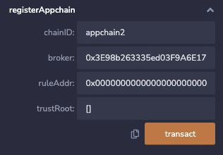
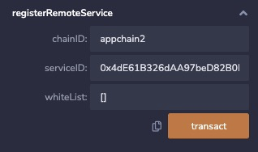

直连模式下，网关pier支持对应用链的管理，包括注册、更新、审计应用链等功能。

注意：在进行应用链管理之前，请确保直连模式下跨链网关正常启动！！直连模式网关启动教程请参考[跨链网关直连模式部署](/v1.18/bitxhub/usage/direct_mode_pier/pier_direct_mode_deploy/)。
**注意！直连模式应用链注册和服务注册在1.18版本及以后，都是通过合约的方式进行管理**

## 1. 应用链注册
对于直连模式下需要加入跨链网络应用链，需要首先在broker合约中注册对方应用链应用链的信息，其参数具体如下：
   - `chainID`：与部署broker合约的appchainID一致
   - `broker`：部署的broker合约地址
   - `ruleAddr`：验证规则地址
   - `trustRoot`：信任根：

例子说明

## 2. 服务注册
同时需要注册对方应用链的服务信息，其具体参数如下：
   - `chainID`：与部署broker合约的appchainID一致
   - `serviceID`：业务合约地址
   - `whiteList`：黑名单

例子说明

## 3. 查询服务列表
通过`getLocalServiceList()`与`getRemoteServiceList()`可以查询到自己与对方应用链的serviceID