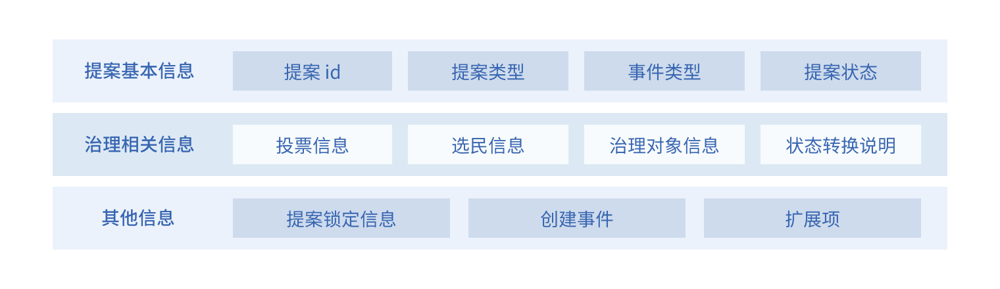
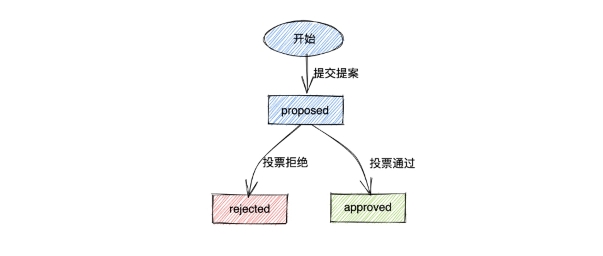
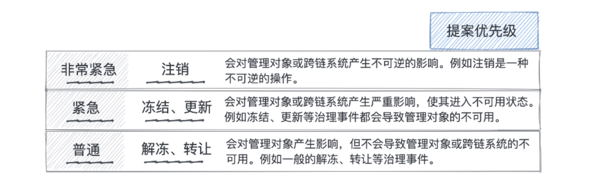
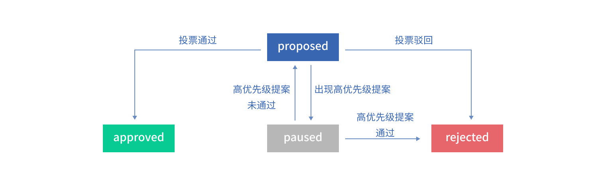
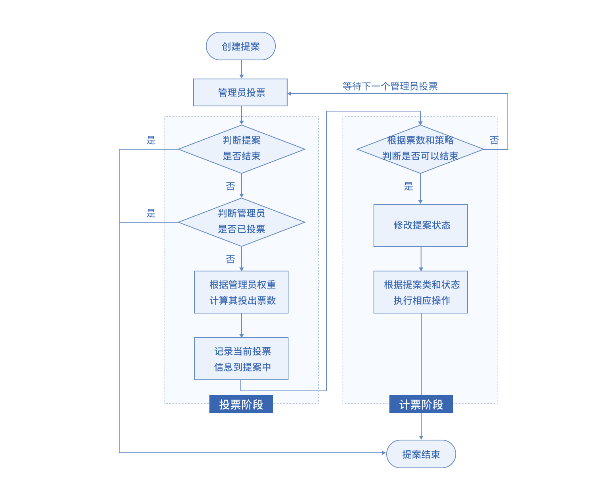

# 提案管理

首先，提案模型具有精简丰富的结构，囊括了治理过程中需要的各类信息；其次，提案的生命周期伴随着治理流程的推进而变化；此外，提案模型针对不同状态设置了不同的优先级，以进一步优化治理流程。接下来，就让我们围绕提案结构、提案生命周期、提案优先级策略这三大模块来一一解剖提案模型。

## 1 提案结构

当跨链平台上产生治理服务范围内的业务时，中继链一般会自动生成一个由业务发起人提交的相应类型提案，以供中继链管理员进行投票治理。提案结构基本涵盖了治理需要的所有关键信息：

- **提案id**：与提案发起人账户地址绑定，作为提案的唯一标识；
- **提案类型**：标识提案所属的治理服务类型，如应用链管理、验证规则管理等；
- **事件类型**：标识提案中发生事件的类型，如注册、更新等；
- **提案状态**：与提案的生命周期对应，有proposed、approved、rejected等状态；
- **投票信息**：包含了该提案当前收到的投票信息、计票信息、超管投票信息等，便于推进提案的投票计票流程（计票流程与提案投票策略有关，将在本系列后续篇章中给出介绍）；
- **选民信息**：包含了该提案面向的选民列表以及当前可用选民数、最低投票选民数等信息，便于推进提案的投票计票流程；
- **治理对象信息**：包含了治理对象的id及其提案发起前状态，记录发起前状态是为了便于投票拒绝时的状态恢复；
- **状态转换说明**：包含了提案的提交理由、结束理由、撤回理由等信息，便于相关人员了解提案的状态转换原因；
- **提案锁定信息**：与提案优先级策略相关的锁定信息；
- **扩展项**：可选项，可附加提案需要的相关信息，如更新提案可以添加更新前后对象的信息对比明细。

## 2 提案生命周期

提案的生命周期展示了一次治理操作的全流程。提案创建后一般会经历proposed、approved、rejected三个状态，特殊情况下还可能出现pause状态。

具体而言，提案生命周期可以分正常投票、撤回、优先级锁定三种情况。

### 2.1 正常投票

正常投票的提案提出后进入投票阶段，即proposed状态，通过投票表决进入到终止阶段，即投票通过为approved状态，投票不通过未rejected状态。

### 2.2 撤回

提案在投票阶段进入proposed状态后，可能会被撤回，撤回又分为主动撤回和被动撤回。主动撤回是提案发起人有机会在提案未结束前发起撤回操作，提案进入终止阶段转换为rejected状态；被动撤回是提案因为系统原因被迫终止，主要有以下两种触发条件：

（1）治理对象被系统清空。比如当一条应用链被注销后，该应用链相关的服务都会被系统自动注销清空，那么这些服务相关未完成的提案也就会被系统撤回进入终止阶段；

（2）投票选民人数不足。每个提案面向的投票选民是提案生成时中继链上所有处于可用状态的治理管理员，在提案进行的过程中，可能有部分管理员被冻结或注销进入不可用状态，这就有可能会导致提案收到的选票数达不到最低门槛值（最低门槛值是提案能够进入终止阶段的一个必要条件，具体实现原理与BitXHub治理机制的投票策略相关，将在本系列后续篇章中给出介绍），当发生这种情况时，提案也会被系统自动撤回。

### 2.3 优先级锁定

优先级锁定与提案的优先级策略有关，将在下文进行详细阐述。

根据以上几种情况的描述，我们会发现治理提案有多种不同的结束场景，为了便于发起人或管理员能够清楚地了解提案结束的原因，提案结构的 **状态转换说明信息** 中有一个 **提案结束理由** 字段将给出说明，该字段会在提案结束时由系统自动填充。

## 3 提案优先级策略

### 3.1 优先级设置

基于提案的治理事件属性以及提案对跨链系统的影响范围考虑，BitXHub治理机制对不同治理事件的提案设置了优先级如下图所示：

不同的管理对象都可能发生注销、冻结、更新等治理事件，发起这些治理事件提案的同时，系统默认为这些治理提案设置了提案优先级。

### 3.2 优先级锁定机制

我们的提案优先级策略主要基于一个原则：**同一管理对象，同一时间只会存在一个进行中的提案。**

实现以上原则的 **前提** 是，提案的优先级比较都是针对同一管理对象的，也就是相关联的提案才会有优先级比较，应用链注销和应用链更新是相关的提案，注销的优先级更高，不相关的提案，比如一个应用链注销的提案，是不会对节点更新产生任何影响的。

在满足同一管理对象的前提下，实现上述原则的 **核心** 就是提案的优先级锁定机制：**高优先级提案进行中时，不可以发起低优先级提案，但低优先级提案进行时，可以发起高优先级提案，并高优先级提案的发起会锁定低优先级提案的进行。**

具体的锁定方式如下图所示:

当某个提案处于proposed状态投票阶段时，若出现更高优先级的提案，那么当前低优先级的提案会暂时进入锁定阶段，转换为pause状态，此时管理员无法对低优先级的提案进行处理——高优先级的提案如果通过可能会对当前管理对象产生重要影响，比如一个应用链注销的提案如果投票通过，那么同时进行的低优先级的应用链更新提案就没有必要再继续进行，此时低优先级提案的锁定状态就避免了可能出现的管理员无意义投票（管理员的投票是通过发交易来执行的，无意义的投票会浪费管理员的发交易成本）以及系统无意义执行（系统的无意义执行包括对管理员对象、提案状态的修改，这些修改都可能涉及对账本内容的修改，冗余的账本读写绘影响系统的运行效率）。

如果高优先级提案投票通过，管理对象状态被改变，低优先级提案就失去了原本的意义，系统会直接结束低优先级提案；如果高优先级提案投票不通过，管理对象状态没有发生变化，低优先级提案恢复原先的proposed状态进入投票阶段。

### 3.3 必要条件约束

为了进一步保证高优先级提案处理的合理有效性，我们还对高优先级提案设置了一个额外的约束条件：针对高优先级的提案，包括非常紧急和紧急的提案，提案的通过除了需要普通管理员投票通过外，还需要得到系统超级管理员的投票。这一约束保证了高优先级提案能被及时处理的同时，还能得到更严谨合理的处理。

## 4 提案管控流程及投票策略

治理提案提交后需要由中继链管理员进行投票，中继链上的投票管控流程如图所示。

投票管控流程主要分为投票和计票两个阶段。投票阶段由各个中继链管理员进行投票，管理员只能对未结束状态（即proposed状态）的提案进行投票，每个管理员只能投一次，但实际投出票数根据管理员的权重进行计算。计票阶段中继链会根据提案的当前投票情况和投票策略判断该提案是否达到结束要求（即通过或拒绝）。每次投票后都会进入计票阶段，若计票时发现提案达到结束要求将会触发相应的业务操作，反之，该提案将继续等待下一个管理员的投票。

提案的投票策略支持多种策略灵活适配，即不同的治理服务可以设置不同的投票策略，投票策略主要包括以下三种类型：

- 简单多数制：若当前赞成票数多则通过提案，反之则拒绝提案；
- 绝对多数赞成制：在收到票数较少时，需要大量赞成票才可以通过；
- 绝对多数反对制：在收到票数较少时，需要大量反对票才可以通过。

绝对多数赞成制和绝对多数反对制支持投票策略的自适应调节，即投票率越低，需要的赞成或反对票数越少，当全员参与投票时，这两种策略均收敛为简单多数制。这种自适应调节可以有效保证提案通过与否的结果代表了群体多数意愿。

## 5 总结

如果说提案模型是一只灵巧的麻雀，那么提案结构就是它的五脏六腑，记录了治理流程中需要的各类信息；提案生命周期就是这只麻雀生老病死的流程，体现了治理流程中各个阶段的推进；提案优先级策略则是这只麻雀的思想和灵魂，让它可以更好地走完这一生——在治理机制中，就是协助管理员和系统对于同一个管理对象只能处理最高优先级的提案，保证BitXHub治理提案投票的便捷有效性和提案执行的合理高效性，从而保证治理流程能够更加方便高效地进行。

但需要注意的是，并非治理机制中所有的治理操作都需要提案模型，一些优先级极低的治理操作可能是不需要提案的，比如更新应用链描述，应用链的描述只是一个展示信息，并不需要中继链治理管理员的严格审核，这种情况下，应用链管理员提交更新请求后即可直接更新，并不会有提案产生。

五脏俱全的提案模型承载着每一次治理流程的行进，也真正赋予BitXHub跨链治理机制以核心动力。