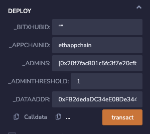
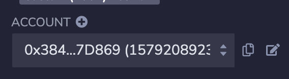

# 1. 应用链跨链合约部署

当前步骤是要在应用链上部署跨链合约broker与事务合约transaction。

我们提供了针对不同应用链的跨链合约和事务合约，下面以Ethereum和Fabric为例进行介绍，其它类型的应用链部署跨链合约的步骤基本上是一致的。

## Ethereum部署跨链合约
broker合约以及transacrion合约可以在[pier-client-ethereum项目](https://github.com/meshplus/pier-client-ethereum)的example目录下获取。

部署broker合约需要有构造参数，具体参数含义可以参考[broker合约的说明](../../../design/broker/#broker_1)。

transaction合约由broker调用，用以维护直连模式下注册服务与跨链交易的事务状态，部署时仅需传入broker合约地址

在Ethereum上部署合约的工具有很多，您可以使用[Remix](https://remix.ethereum.org/)进行合约的编译和部署，也可以使用Goduck进行部署：

=== "Remix"

    broker合约构造参数如下：

    ```
    """^ethappchain1^[]^0^["0x20F7Fac801C5Fc3f7E20cFbADaA1CDb33d818Fa3"]^1"
    ```

    
    

    ```
    注意：填写参数时，需要将ADMINS参数使用账户ACCOUNT代替
    ```

    transaction合约构造参数如下
    
    ```
    #该地址为部署完成后的broker合约地址
    0x857133c5C69e6Ce66F7AD46F200B9B3573e77582
    ```

    
    

=== "Goduck"

    Step1: 获取goduck工具（若已获取可跳过）

    ```shell
    git clone https://github.com/meshplus/goduck.git
    cd goduck && make install
    # 初始化goduck配置
    goduck init
    ```

    Step2: 部署broker合约

    ```shell
    # address指定以太坊地址
    # key-path指定以太坊账户地址的私钥，goduck使用该账户进行合约部署，所以需要保证该账户有足够的gas费进行合约部署
    # psd-path指定以太坊账户地址私钥的密码
    # code-path指定broker.sol合约路径（在pier-client-ethereum/example目录下）
    # 合约的构造参数通过"^"进行分割
    # 注意!!!由于goduck采用远程编译的方式进行，需要确保以太坊所在服务器有对应的solitidy编译环境
    goduck ether contract deploy \
    --address http://localhost:8545 \
    --key-path account.key \
    --psd-path password \
    --code-path broker.sol \
    """^ethappchain1^[]^0^["0x20F7Fac801C5Fc3f7E20cFbADaA1CDb33d818Fa3"]^1"
    ```

    

    
    Step2: 部署transaction合约
    ```shell
    goduck ether contract deploy \
    --address http://localhost:8545 \
    --key-path account.key \
    --psd-path password \
    --code-path transaction.sol \
    "0x857133c5C69e6Ce66F7AD46F200B9B3573e77582"
    ```


**说明**：部署broker合约后，需要 **记住broker合约的地址** ，后续业务合约可能需要引用broker合约的地址，才能正确完成跨链调用。


## Fabric部署跨链合约
broker合约以及transacrion合约可以在[pier-client-fabric项目](https://github.com/meshplus/pier-client-fabric)的example目录下获取。

Fabric部署合约可以使用[fabric-cli](https://github.com/hyperledger/fabric-cli)，也可以使用Goduck：

=== "Fabric-cli"

    Step1: 安装部署合约的工具fabric-cli

    ```shell
    go get github.com/securekey/fabric-examples/fabric-cli/cmd/fabric-cli(go1.16版本以下)
    Ps:由于fabric官方没有继续维护，可能导致go1.16及以上版本使用go install安装出错
    可以通过该链接下载编译好的二进制https://github.com/meshplus/pier-client-fabric/releases/tag/v2.0.0
    ```

    Step2: 部署broker合约

    ```shell
    # --gopath 为pier-client-fabric/exmaple目录下的contracts目录
    # 安装和示例化broker合约，其中${CONFIG_YAML}为fabric配置文件的路径
    fabric-cli chaincode install --gopath ./contracts --ccp broker --ccid broker --config "${CONFIG_YAML}" --orgid org2 --user Admin --cid mychannel
    fabric-cli chaincode instantiate --ccp broker --ccid broker \
    --config "${CONFIG_YAML}" --orgid org2 --user Admin --cid mychannel

    # 初始化合约参数(直连模式下不需要中继链的chainId,只需应用链id即可)
    fabric-cli chaincode invoke --cid mychannel --ccid=broker \
    --args='{"Func":"initialize", "Args":["", "fabappchain","1"]}' \
    --user Admin --orgid org2 --payload --config "${CONFIG_YAML}"
    ```

    Step3: 部署transaction合约
    ```shell
    # --gopath 为pier-client-fabric/exmaple目录下的contracts目录
    # 安装和示例化broker合约，其中${CONFIG_YAML}为fabric配置文件的路径
    fabric-cli chaincode install --gopath ./contracts --ccp transaction --ccid transaction --config "${CONFIG_YAML}" --orgid org2 --user Admin --cid mychannel
    fabric-cli chaincode instantiate --ccp transaction --ccid broker \
    --config "${CONFIG_YAML}" --orgid org2 --user Admin --cid mychannel

    fabric-cli chaincode invoke --cid mychannel --ccid=broker \
    --args='{"Func":"initialize", "Args":[]}' \
    --user Admin --orgid org2 --payload --config "${CONFIG_YAML}"
    ```

=== "Goduck"

    Step1: 获取goduck工具（若已获取可跳过）

    ```shell
    git clone https://github.com/meshplus/goduck.git
    cd goduck && make install
    # 初始化goduck配置
    goduck init
    ```

    Step2: 部署broker合约

    ```shell
    # config-path指定fabric配置文件路径
    # gopath指定fabric合约路径，pier-client-fabric/exmaple目录下的contracts目录
    # ccp指定fabric chaincode路径
    # ccid指定fabric chaincode id
    # version指定fabric chaincode版本
    # 注意！！！config.yaml如果使用的变量，需要指定具体的证书路径
    goduck fabric deploy \
    --config-path config.yaml \
    --gopath contracts
    --ccp broker \
    --ccid broker \
    --version 1

    # 初始化直连broker合约不需要提供BitXHub的chainId，只需对应应用链的ID
    goduck fabric contract invoke --config-path config.yaml broker initialize "",fabappchain,1
    ```

    

    Step3: 部署transaction合约

    ```shell
    goduck fabric deploy \
    --config-path config.yaml \
    --gopath contracts
    --ccp transaction \
    --ccid transaction \
    --version 1
    
    #目前transaction合约的initialize不需要传入任何参数，仅对相关存储内容进行初始化操作
    goduck fabric contract invoke --config-path config.yaml transaction initialize 
    ```
