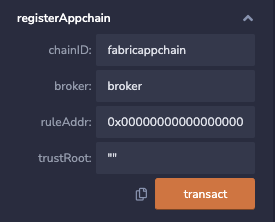

# 3. 注册应用链

**注意！直连模式应用链注册在1.18版本及以后，都是通过合约的方式进行管理**。

对于直连模式下需要加入跨链网络应用链，需要首先在broker合约中注册对方应用链应用链的信息，其参数具体如下：

- `chainID`：与部署broker合约的appchainID一致；
- `broker`：部署的broker合约地址；
- `ruleAddr`：验证规则地址；
- `trustRoot`：应用链信任根，不同的共识算法的信任根的类型不同，对于PoW共识的应用链，`trustRoot`为某一个高度的区块头，对于PoS共识的区块链，`trustRoot`为验证人集合。

**举例说明：**

## Ethereum注册应用链

需要在以太坊应用链的broker合约上调用相关函数注册需要被调用方的应用链

在Ethereum上部署合约的工具有很多，您可以使用[Remix](https://remix.ethereum.org/)进行合约的编译和部署，也可以使用Goduck进行部署：

=== "Remix"
    registerAppchain 注册应用链 传入参数如下
    ```
    "fabricappchain"^"broker"^"0x00000000000000000000000000000000000000a2"^""
    ```
    
    

=== "Goduck"
    
    Step1: 获取goduck工具（若已获取可跳过）

    ```shell
    git clone https://github.com/meshplus/goduck.git
    cd goduck && make install
    # 初始化goduck配置
    goduck init
    ```

    Step2: 注册fabric应用链
    ```shell
    goduck ether contract invoke 
    --key-path account.key 
    --abi-path broker.abi 
    --address http://localhost:8545 0x857133c5C69e6Ce66F7AD46F200B9B3573e77582
    registerAppchain "fabricappchain"^"broker"^"0x00000000000000000000000000000000000000a2"^""
    ```

## Fabric注册应用链
    
Fabric部署合约可以使用[fabric-cli](https://github.com/hyperledger/fabric-cli)，也可以使用Goduck：

=== "Fabric-cli"

    Step1: 安装部署合约的工具fabric-cli

    ```shell
    cd ~/bitxhub-v2.0.0 && go get github.com/securekey/fabric-examples/fabric-cli/cmd/fabric-cli
    ```

    Step2: 注册应用链
    ```shell
     fabric-cli chaincode invoke --cid mychannel --ccid=broker \
    --args='{"Func":"initialize", "Args":["ethappchain1",0x857133c5C69e6Ce66F7AD46F200B9B3573e77582,"","0x00000000000000000000000000000000000000a2"]}' \
    --user Admin --orgid org2 --payload --config "${CONFIG_YAML}"
    ```


=== "Goduck"

    Step1: 获取goduck工具（若已获取可跳过）

    ```shell
    git clone https://github.com/meshplus/goduck.git
    cd goduck && make install
    # 初始化goduck配置
    goduck init
    ```

    Step2: 注册应用链
    ```shell
    goduck fabric contract invoke broker registerAppchain 
    ethappchain1,0x857133c5C69e6Ce66F7AD46F200B9B3573e77582,"",0x00000000000000000000000000000000000000a2
    ```

