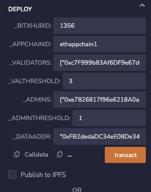

# 2. 应用链跨链合约部署

当前步骤是要在应用链上部署跨链合约broker和数据合约broker_data。

我们提供了针对不同应用链的跨链合约，下面以Ethereum和Fabric为例进行介绍，其它类型的应用链部署跨链合约的步骤基本上是一致的。

## Ethereum部署跨链合约

跨链合约broker和数据合约broker_data可以在[pier-client-ethereum项目](https://github.com/meshplus/pier-client-ethereum)的example目录下获取。

在Ethereum上部署合约的工具有很多，您可以使用[Remix](https://remix.ethereum.org/)进行合约的编译和部署，也可以使用Goduck进行部署：

=== "Remix"

    ### 2.1 部署broker_data合约
    
    在部署broker合约之前需要部署broker_data合约，broker_data合约构造参数如下：
    
    ```
    ["0x20f7fac801c5fc3f7e20cfbadaa1cdb33d818fa3"]^1
    ```
    
    - **`_ADMINS`: 管理员的地址，一般使用部署合约的账户地址；**
    - `_ADMINTHRESHOLD`：投票通过的最少应用链管理员数量，如果创建合约的账户只有1个，填入1。
    
    说明：部署broker_data合约后，需要记住 **broker_data合约的地址** ，用于broker合约部署。
    
    
    
    ### 2.2 部署Broker合约
    
    broker合约构造参数示例如下：
    
    ```
    "1356","ethappchain",["0xc7F999b83Af6DF9e67d0a37Ee7e900bF38b3D013","0x79a1215469FaB6f9c63c1816b45183AD3624bE34","0x97c8B516D19edBf575D72a172Af7F418BE498C37","0xc0Ff2e0b3189132D815b8eb325bE17285AC898f8"],"3",["0x20f7fac801c5fc3f7e20cfbadaa1cdb33d818fa3"],"1","0xFB2dedaDC34eE08De344BbB2344f4513b7be433F"
    ```
    
    
    
    
    ```
    注意：填写参数时，需要将ADMINS参数使用账户ACCOUNT代替
    ```
    
    - `_BITXHUBID`：中继链的链id，默认不变；
    
    - `_APPCHAINID`：应用链在中继链上的链id，应与pier向中继链注册的链id一致；
    
    - `_VALIDATORS` ：中继链创世管理员的地址，默认不变；
    
    - `_VALTHORESHOLD`：合约验证中继链多签的阈值，阈值必须严格小于等于中继链创世管理员数量，默认不变
    
    - **`_ADMINS`：管理员的地址，一般使用部署合约的账户地址；**
    
    - `_ADMINTHRESHOLD`：投票通过的最少应用链管理员数量，如果创建合约的账户只有1个，填入1，默认不变；
    
    - `_DATAADDR`：broker_data合约地址，需要拷贝2.1步骤输出的地址。

=== "Goduck"

    Step1：获取goduck工具（若已获取可跳过）
    
    ```shell
    git clone https://github.com/meshplus/goduck.git
    cd goduck && make install
    # 初始化goduck配置
    goduck init
    ```
    
    Step2：部署broker_data合约
    
    ```shell
    goduck ether contract deploy \
    --address http://localhost:8545 \
    --key-path account.key \
    --psd-path password \
    --code-path broker_data.sol \
    ["0x20f7fac801c5fc3f7e20cfbadaa1cdb33d818fa3"]^"1"
    # 0x20f7fac801c5fc3f7e20cfbadaa1cdb33d818fa3是管理员的地址，一般使用部署合约的账户地址
    # 1是投票通过的最少应用链管理员数量，如果创建合约的账户只有1个，填入1
    ```
    
    Step3：部署broker合约
    
    ```shell
    # address指定以太坊地址
    # key-path指定以太坊账户地址的私钥，goduck使用该账户进行合约部署，所以需要保证该账户有足够的gas费进行合约部署
    # psd-path指定以太坊账户地址私钥的密码
    # code-path指定broker.sol合约路径（在pier-client-ethereum/example目录下）
    # 合约的构造参数通过"^"进行分割
    # 注意!!!由于goduck采用远程编译的方式进行，需要确保以太坊所在服务器有对应的solitidy编译环境
    goduck ether contract deploy \
    --address http://localhost:8545 \
    --key-path account.key \
    --psd-path password \
    --code-path broker.sol \
    "1356"^"ethappchain"^["0xc7F999b83Af6DF9e67d0a37Ee7e900bF38b3D013","0x79a1215469FaB6f9c63c1816b45183AD3624bE34","0x97c8B516D19edBf575D72a172Af7F418BE498C37","0xc0Ff2e0b3189132D815b8eb325bE17285AC898f8"]^"3"^["0x20f7fac801c5fc3f7e20cfbadaa1cdb33d818fa3"]^"1"^"0xFB2dedaDC34eE08De344BbB2344f4513b7be433F"
    # 1356是中继链的链id
    # ethappchain是应用链在中继链上的链id
    # ["0xc7F999b83Af6DF9e67d0a37Ee7e900bF38b3D013","0x79a1215469FaB6f9c63c1816b45183AD3624bE34","0x97c8B516D19edBf575D72a172Af7F418BE498C37","0xc0Ff2e0b3189132D815b8eb325bE17285AC898f8"]是中继链创世管理员的地址
    # 3是合约验证中继链多签的阈值，阈值必须严格小于等于中继链创世管理员数量
    # ["0x20f7fac801c5fc3f7e20cfbadaa1cdb33d818fa3"]是管理员的地址，一般使用部署合约的账户地址
    # 1是投票通过的最少应用链管理员数量，如果创建合约的账户只有1个，填入1
    # 0xFB2dedaDC34eE08De344BbB2344f4513b7be433F是broker_data合约地址
    ```
    
    

**说明**：部署broker合约后，需要 **记住broker合约的地址**，后续业务合约可能需要引用broker合约的地址，才能正确完成跨链调用。

## Fabric部署跨链合约

broker合约可以在[pier-client-fabric项目](https://github.com/meshplus/pier-client-fabric)的example目录下获取：

```shell
git clone https://github.com/meshplus/pier-client-fabric.git
cd pier-client-fabric && git checkout release-2.8
# 需要部署的合约文件就在example目录下
# 解压即可
cd example && unzip -q contracts.zip
```

Fabric部署合约可以使用[fabric-cli](https://github.com/securekey/fabric-examples/tree/master/fabric-cli)，也可以使用Goduck：

=== "Fabric-cli"

    Step1: 安装部署合约的工具fabric-cli
    
    ```shell
    go get github.com/securekey/fabric-examples/fabric-cli/cmd/fabric-cli(go1.16版本以下)
    # ps：由于fabric-cli这个项目后续没有再维护导致go1.16及以上通过go install获取会产生编译问题
    # 可以通过该链接下载编译好的二进制https://github.com/meshplus/pier-client-fabric/releases/tag/v2.0.0
    ```
    
    Step2: 部署broker合约
    
    ```shell
    # --gopath 为pier-client-fabric/exmaple目录下的contracts目录
    # 安装和示例化broker合约，其中${CONFIG_YAML}为fabric配置文件的路径，初始文件路径为pier-client-fabric/config/config.yaml
    fabric-cli chaincode install --gopath ./contracts --ccp broker --ccid broker --config "${CONFIG_YAML}" --orgid org2 --user Admin --cid mychannel
    fabric-cli chaincode instantiate --ccp broker --ccid broker \
    --config "${CONFIG_YAML}" --orgid org2 --user Admin --cid mychannel
    
    # 初始化合约参数(以中继链id=1356和应用链id=fabappchain为例)
    fabric-cli chaincode invoke --cid mychannel --ccid=broker \
    --args='{"Func":"initialize", "Args":["1356", "fabappchain"]}' \
    --user Admin --orgid org2 --payload --config "${CONFIG_YAML}"
    ```
    
    ```shell
    注意：config.yaml文件不可以直接使用，需要修改所有${CONFIG_PATH}为启动的fabric
    所生成的配置文件的路径，以fabric—samples为例，生成的配置文件路径为fabric-samples/first-network/crypto-config
    ```


=== "Goduck"

    Step1: 获取goduck工具（若已获取可跳过）
    
    ```shell
    git clone https://github.com/meshplus/goduck.git
    cd goduck && make install
    # 初始化goduck配置
    goduck init
    ```
    
    Step2: 部署broker合约
    
    ```shell
    # config-path指定fabric配置文件路径
    # gopath指定fabric合约路径，pier-client-fabric/exmaple目录下的contracts目录
    # ccp指定fabric chaincode路径
    # ccid指定fabric chaincode id
    # version指定fabric chaincode版本
    # 注意！！！config.yaml如果使用的变量，需要指定具体的证书路径
    goduck fabric deploy \
    --config-path config.yaml \
    --gopath contracts
    --ccp broker \
    --ccid broker \
    --version 1
    
    # 初始化broker合约需要提供BitXHub的chainId，以及对应应用链的ID
    goduck fabric contract invoke --config-path config.yaml broker initialize 1356,fabappchain
    ```
    
    
