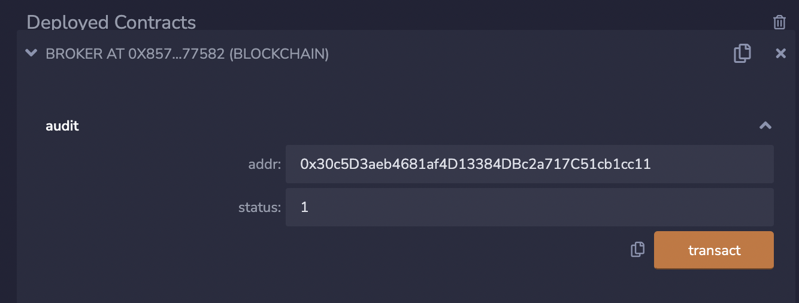

# 1. 部署业务合约

这一步需将业务合约部署到应用链上，并让broker合约审核业务合约。

若业务合约已部署，可跳过部署步骤，直接进行审核。

接下来，将以Ethereum和Fabric部署、审核示例业务合约transfer为例进行介绍，其它类型应用链的步骤基本上一致。

## 部署业务合约

### Ethereum

示例业务合约transfer.sol在[pier-client-ethereum项目](https://github.com/meshplus/pier-client-ethereum)exampe目录下。

在Ethereum上部署合约的工具有很多，您可以使用[Remix](https://remix.ethereum.org/)进行合约的编译和部署，也可以使用Goduck进行部署：

=== "Remix"

    部署示例业务合约transfer时，然后将broker合约的合约地址填入transfer合约中的`BrokerAddr`字段，这样业务合约才能正确跨链调用。

=== "Goduck"

    ```shell
    goduck ether contract deploy \
    --address http://localhost:8545 \
    --key-path account.key \
    --psd-path password \
    --code-path transfer.sol \
    "0x857133c5C69e6Ce66F7AD46F200B9B3573e77582"
    # 部署transfer合约需要提供broker合约的地址，即"0x857133c5C69e6Ce66F7AD46F200B9B3573e77582"
    ```
    

**说明**：业务合约部署好之后，**需要记住业务合约的合约地址** ，后续broker合约审核业务合约需使用。

### Fabric

transfer合约可以在[pier-client-fabric项目](https://github.com/meshplus/pier-client-fabric)的example目录下获取：

```shell
git clone https://github.com/meshplus/pier-client-fabric.git
cd pier-client-fabric && git checkout v2.0.0
# 需要部署的合约文件就在example目录下
# 解压即可
cd example && unzip -q contracts.zip
```

Fabric部署合约可以使用[fabric-cli](https://github.com/hyperledger/fabric-cli)，也可以使用Goduck：

=== "Fabric-cli"

    Step1: 安装部署合约的工具fabric-cli（若已安装，可跳过）
    ```shell
    cd ~/bitxhub-v2.0.0 && go get github.com/securekey/fabric-examples/fabric-cli/cmd/fabric-cli
    ```

    Step2: 部署transfer合约
    ```shell
    # --gopath 为pier-client-fabric/exmaple目录下的contracts目录
    # 安装和示例化transfer合约
    fabric-cli chaincode install --gopath ./contracts --ccp transfer --ccid transfer --config "${CONFIG_YAML}" --orgid org2 --user Admin --cid mychannel
    fabric-cli chaincode instantiate --ccp transfer --ccid transfer --config "${CONFIG_YAML}" --orgid org2 --user Admin --cid mychannel

    # 业务合约需要向broker发起注册请求
    fabric-cli chaincode invoke --cid mychannel --ccid=transfer \
    --args='{"Func":"register"}' \
    --user Admin --orgid org2 --payload --config "${CONFIG_YAML}"
    ```

=== "Goduck"

    Step1: 获取goduck工具（若已获取可跳过）

    ```shell
    git clone https://github.com/meshplus/goduck.git
    cd goduck && make install
    # 初始化goduck配置
    goduck init
    ```

    Step2: 部署transfer合约

    ```shell
    # 部署业务合约
    # config-path指定fabric配置文件路径
    # gopath指定fabric合约路径，pier-client-fabric/exmaple目录下的contracts目录
    # ccp指定fabric chaincode路径
    # ccid指定fabric chaincode id
    # version指定fabric chaincode版本
    goduck fabric deploy \
    --config-path config.yaml \
    --gopath contracts
    --ccp transfer \
    --ccid transfer \
    --version 1

    # transfer合约向broker合约发起注册
    goduck fabric contract invoke --config-path config.yaml transfer register
    ```
    

## broker合约审核业务合约

业务合约部署完成后，需要broker合约审核通过，才能发起或接受跨链交易，具体方法是：调用broker合约的audit方法，其参数依次是业务合约地址和合约状态（数字1表示审核通过，数字2表示审核失败）。

### Ethereum

对于Ethereum，可以使用Remix和Goduck，调用broker合约的audit方法，传入业务合约地址、合约状态完成审核。

=== "Remix"

    

=== "Goduck"

    ```shell
    # abi-path指定abi文件
    # "0x857133c5C69e6Ce66F7AD46F200B9B3573e77582"为broker合约地址
    # "0x30c5D3aeb4681af4D13384DBc2a717C51cb1cc11"^"1"是传入audit方法的参数，第一个参数为业务合约地址
    goduck ether contract invoke \
    --address http://localhost:8545 \
    --key-path account.key \
    --psd-path password \
    --abi-path broker.abi \
    "0x857133c5C69e6Ce66F7AD46F200B9B3573e77582" audit "0x30c5D3aeb4681af4D13384DBc2a717C51cb1cc11"^"1"
    ```

### Fabric

对于Fabric，可以使用Fabric-cli和Goduck，调用broker合约的audit方法，参数依次为：通道名称（默认mychannel）、业务合约名称、合约状态。

=== "Fabric-cli"

    ```shell
    fabric-cli chaincode invoke --cid mychannel --ccid=broker \
    --args='{"Func":"audit", "Args":["mychannel", "transfer", "1"]}' \
    --user Admin --orgid org2 --payload --config "${CONFIG_YAML}"
    ```

=== "Goduck"

    ```shell
    goduck fabric contract invoke --config-path config.yaml broker audit mychannel,transfer,1
    ```
