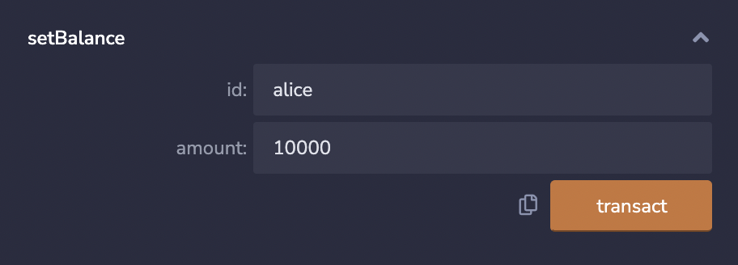
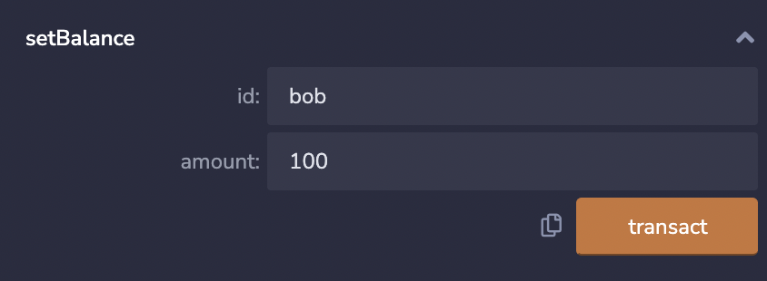
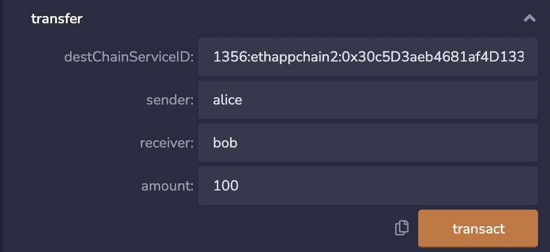

# 3. 发起跨链交易

在至少两条应用链以及相关服务部署成功后，才可以发起跨链交易请求。这里，以id为ethappchain1和ethappchain2的两条应用链为例：

1. 我们需要分别为两条应用链新建一个账户。其中，ethappchain1的账户名为alice，账户金额为10000。ethappchain2的账户名为bob，账户金额为100。
    
    

2. 设置账户以及金额成功之后便可以发起跨链交易请求。在此，我们以alice向bob转账100做一个示例。

    在remix调用ethappchain1的transfer合约中的transfer方法，transfer合约中的四个参数分别为destChainServiceID，sender，receiver以及amount。需要注意的是，destChainServiceID参数的格式为: `中继链id:目的链id:transfer合约地址`。

    示例如下图：

    

    在示例跨链交易请求中，输入的destChainServiceID是`1356:ethappchain2:0x30c5D3aeb4681af4D13384DBc2a717C51cb1cc11`。其中，1356为中继链id，ethappchain2为目的链id，0x30c5D3aeb4681af4D13384DBc2a717C51cb1cc11为应用链2上transfer合约的地址。
    
    假如目标链为fabric时，示例destChainServiceID为`1356:fabappchain:mychannel&transfer`。其中，1356为中继链id，fabappchain为目的链id，mychannel&transfer为fabric应用链上service-id。

3. 发起跨链交易请求成功后，通过调用应用链上transfer合约的getBalance方法可以得到此时alice和bob账户的金额。
    
    

    alice账户的金额应该为9900，bob账户的金额应该为200，说明跨链交易成功。
