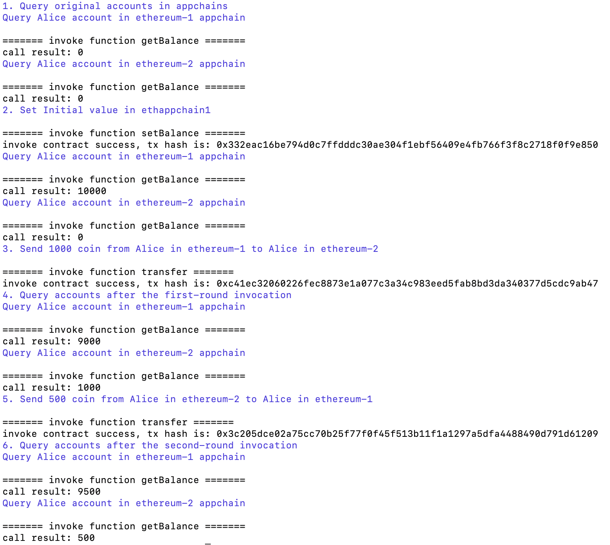

# 快速开始
我们提供了快速开始命令来体验跨链流程。

## 1 环境准备
> Goduck快速开始依赖于Docker和Docker-Compose，需要提前准备好[docker环境](../../bitxhub/quick_start/build_cross_network/env)。 <br />
> Goduck快速开始通过两条以太坊私链的智能合约交互来示例，需要提前安装solc来编译以太坊solidity合约，建议安装solc0.7.6版本


## 2 获取源码
下载源码并切到稳定版本release-2.8
```shell
git clone git@github.com:meshplus/goduck.git
cd goduck
git checkout release-2.8
```

## 3 初始化
```shell
sudo make install
goduck init
```
初始化成功将会打印日志如下
```
Init goduck successfully in $HOME/.goduck!
```
在goduck同级目录可以看到生成的.goduck文件夹

## 4 启动跨链网络
在本地启动两条以太坊私链并在其上部署相应的智能合约，此外还会启动一个solo版本的BitXHub节点以及与以太坊私链对应的两个跨链网关，启动命令如下：
```shell
goduck playground start
```
**该命令执行的具体操作包括以下步骤**：

- 获取以太坊以及bitxhub镜像并创建相应容器：
  ```shell
  Creating network "quick_start_default" with the default driver
  Creating ethereum-1      ... done
  Creating ethereum-2      ... done
  Creating bitxhub_solo    ... done
  ```

- 在以太坊私链上部署对应的智能合约并进行审计

如果以太坊智能私链的智能合约部署成功并完成对transfer合约的审计，最终会打印出日志如下：
  ```shell
  Deploy Contract in ethereum1
  Deploy broker_data contract
  broker_data1 contract address: 0x857133c5C69e6Ce66F7AD46F200B9B3573e77582
  Deploy broker contract
  broker1 contract address: 0x30c5D3aeb4681af4D13384DBc2a717C51cb1cc11
  aduit contract

  ======= invoke function audit =======
  invoke contract success, tx hash is: 0xf64d965e119c9b590fb409129c3e030430fa4c0a56202f26b2d206c806a3cfbe
  aduit contract aduit:successful
  Deploy transfer contract
  transfer1 contract address: 0xb00AC45963879cb9118d13120513585873f81Cdb
  aduit contract

  ======= invoke function audit =======
  invoke contract success, tx hash is: 0xbbc85fe9b7b89a7c1733875037c8f7423a8c58e52ca1cad07bd34abb1c156870
  aduit contract aduit:successful
  ```


> **注意！！！** 如果打印结果有误，请检查$HOME/goduck/scripts/example下的brokerAddr、brokerDataAddr和transferAddr文件，如果文件内容与以下日志不符，请检查本地安装的solc版本（solc版本支持0.6.9~0.7.6），solc安装教程可参考：[solc多版本安装](https://protective-jodhpur-ccb.notion.site/solc-682749e953bc4881a2f97f13e51b8d2b)。


  ```
  ======= $HOME/.goduck/scripts/example/broker.sol:Broker =======
  Deployed contract address is 0x857133c5C69e6Ce66F7AD46F200B9B3573e77582
  Contract JSON ABI
  [{"inputs":[{"internalType":"string","name":"_bitxhubID","type":"string"},{"internalType":"string","name":"_appchainID","type":"string"},{"internalType":"address[]","name":"_validators","type":"address[]"},{"internalType":"uint64","name":"_valThreshold","type":"uint64"},{"internalType":"address[]","name":"_admins","type":"address[]"},{"internalType":"uint64","name":"_adminThreshold","type":"uint64"}],"stateMutability":"nonpayable","type":"constructor"},{"anonymous":false,"inputs":[{"indexed":false,"internalType":"uint64","name":"index","type":"uint64"},{"indexed":false,"internalType":"string","name":"dstFullID","type":"string"},{"indexed":false,"internalType":"string","name":"srcFullID","type":"string"},{"indexed":false,"internalType":"string","name":"func","type":"string"},{"indexed":false,"internalType":"bytes[]","name":"args","type":"bytes[]"},{"indexed":false,"internalType":"bytes32","name":"hash","type":"bytes32"}],"name":"throwInterchainEvent","type":"event"},{"anonymous":false,"inputs":[{"indexed":false,"internalType":"uint64","name":"index","type":"uint64"},{"indexed":false,"internalType":"string","name":"dstFullID","type":"string"},{"indexed":false,"internalType":"string","name":"srcFullID","type":"string"},{"indexed":false,"internalType":"uint64","name":"typ","type":"uint64"},{"indexed":false,"internalType":"bool","name":"status","type":"bool"},{"indexed":false,"internalType":"bytes[]","name":"result","type":"bytes[]"},{"indexed":false,"internalType":"bytes32","name":"hash","type":"bytes32"}],"name":"throwReceiptEvent","type":"event"},{"anonymous":false,"inputs":[{"indexed":false,"internalType":"bool","name":"","type":"bool"}],"name":"throwReceiptStatus","type":"event"},{"inputs":[{"internalType":"address","name":"addr","type":"address"},{"internalType":"int64","name":"status","type":"int64"}],"name":"audit","outputs":[{"internalType":"bool","name":"","type":"bool"}],"stateMutability":"nonpayable","type":"function"},{"inputs":[{"internalType":"string","name":"destFullServiceID","type":"string"},{"internalType":"string","name":"funcCall","type":"string"},{"internalType":"bytes[]","name":"args","type":"bytes[]"},{"internalType":"string","name":"funcCb","type":"string"},{"internalType":"bytes[]","name":"argsCb","type":"bytes[]"},{"internalType":"string","name":"funcRb","type":"string"},{"internalType":"bytes[]","name":"argsRb","type":"bytes[]"},{"internalType":"bool","name":"isEncrypt","type":"bool"}],"name":"emitInterchainEvent","outputs":[],"stateMutability":"nonpayable","type":"function"},{"inputs":[{"internalType":"string","name":"chainID","type":"string"}],"name":"getAppchainInfo","outputs":[{"internalType":"string","name":"","type":"string"},{"internalType":"bytes","name":"","type":"bytes"},{"internalType":"address","name":"","type":"address"}],"stateMutability":"view","type":"function"},{"inputs":[],"name":"getCallbackMeta","outputs":[{"internalType":"string[]","name":"","type":"string[]"},{"internalType":"uint64[]","name":"","type":"uint64[]"}],"stateMutability":"view","type":"function"},{"inputs":[],"name":"getChainID","outputs":[{"internalType":"string","name":"","type":"string"},{"internalType":"string","name":"","type":"string"}],"stateMutability":"view","type":"function"},{"inputs":[{"internalType":"string","name":"id","type":"string"}],"name":"getDirectTransactionMeta","outputs":[{"internalType":"uint256","name":"","type":"uint256"},{"internalType":"uint64","name":"","type":"uint64"}],"stateMutability":"view","type":"function"},{"inputs":[],"name":"getDstRollbackMeta","outputs":[{"internalType":"string[]","name":"","type":"string[]"},{"internalType":"uint64[]","name":"","type":"uint64[]"}],"stateMutability":"view","type":"function"},{"inputs":[],"name":"getInnerMeta","outputs":[{"internalType":"string[]","name":"","type":"string[]"},{"internalType":"uint64[]","name":"","type":"uint64[]"}],"stateMutability":"view","type":"function"},{"inputs":[],"name":"getLocalServiceList","outputs":[{"internalType":"string[]","name":"","type":"string[]"}],"stateMutability":"view","type":"function"},{"inputs":[{"internalType":"address","name":"addr","type":"address"}],"name":"getLocalWhiteList","outputs":[{"internalType":"bool","name":"","type":"bool"}],"stateMutability":"view","type":"function"},{"inputs":[{"internalType":"string","name":"outServicePair","type":"string"},{"internalType":"uint64","name":"idx","type":"uint64"}],"name":"getOutMessage","outputs":[{"internalType":"string","name":"","type":"string"},{"internalType":"bytes[]","name":"","type":"bytes[]"},{"internalType":"bool","name":"","type":"bool"}],"stateMutability":"view","type":"function"},{"inputs":[],"name":"getOuterMeta","outputs":[{"internalType":"string[]","name":"","type":"string[]"},{"internalType":"uint64[]","name":"","type":"uint64[]"}],"stateMutability":"view","type":"function"},{"inputs":[{"internalType":"string","name":"remoteAddr","type":"string"}],"name":"getRSWhiteList","outputs":[{"internalType":"address[]","name":"","type":"address[]"}],"stateMutability":"view","type":"function"},{"inputs":[{"internalType":"string","name":"inServicePair","type":"string"},{"internalType":"uint64","name":"idx","type":"uint64"}],"name":"getReceiptMessage","outputs":[{"internalType":"bytes[]","name":"","type":"bytes[]"},{"internalType":"uint64","name":"","type":"uint64"},{"internalType":"bool","name":"","type":"bool"}],"stateMutability":"view","type":"function"},{"inputs":[],"name":"getRemoteServiceList","outputs":[{"internalType":"string[]","name":"","type":"string[]"}],"stateMutability":"view","type":"function"},{"inputs":[],"name":"initialize","outputs":[],"stateMutability":"nonpayable","type":"function"},{"inputs":[{"internalType":"string","name":"srcFullID","type":"string"},{"internalType":"string","name":"destAddr","type":"string"},{"internalType":"uint64","name":"index","type":"uint64"},{"internalType":"uint64","name":"typ","type":"uint64"},{"internalType":"string","name":"callFunc","type":"string"},{"internalType":"bytes[]","name":"args","type":"bytes[]"},{"internalType":"uint64","name":"txStatus","type":"uint64"},{"internalType":"bytes[]","name":"signatures","type":"bytes[]"},{"internalType":"bool","name":"isEncrypt","type":"bool"}],"name":"invokeInterchain","outputs":[],"stateMutability":"payable","type":"function"},{"inputs":[{"internalType":"string","name":"srcAddr","type":"string"},{"internalType":"string","name":"dstFullID","type":"string"},{"internalType":"uint64","name":"index","type":"uint64"},{"internalType":"uint64","name":"typ","type":"uint64"},{"internalType":"bytes[]","name":"result","type":"bytes[]"},{"internalType":"uint64","name":"txStatus","type":"uint64"},{"internalType":"bytes[]","name":"signatures","type":"bytes[]"}],"name":"invokeReceipt","outputs":[],"stateMutability":"payable","type":"function"},{"inputs":[],"name":"register","outputs":[],"stateMutability":"nonpayable","type":"function"},{"inputs":[{"internalType":"string","name":"chainID","type":"string"},{"internalType":"string","name":"broker","type":"string"},{"internalType":"address","name":"ruleAddr","type":"address"},{"internalType":"bytes","name":"trustRoot","type":"bytes"}],"name":"registerAppchain","outputs":[],"stateMutability":"nonpayable","type":"function"},{"inputs":[],"name":"registerDirectTransaction","outputs":[],"stateMutability":"nonpayable","type":"function"},{"inputs":[{"internalType":"string","name":"chainID","type":"string"},{"internalType":"string","name":"serviceID","type":"string"},{"internalType":"address[]","name":"whiteList","type":"address[]"}],"name":"registerRemoteService","outputs":[],"stateMutability":"nonpayable","type":"function"}]


  ======= $HOME/.goduck/scripts/example/transfer.sol:Transfer =======
  Deployed contract address is 0x30c5D3aeb4681af4D13384DBc2a717C51cb1cc11
  Contract JSON ABI
  [{"inputs":[{"internalType":"address","name":"_brokerAddr","type":"address"}],"stateMutability":"nonpayable","type":"constructor"},{"inputs":[{"internalType":"bytes","name":"b","type":"bytes"}],"name":"bytesToUint64","outputs":[{"internalType":"uint64","name":"","type":"uint64"}],"stateMutability":"pure","type":"function"},{"inputs":[{"internalType":"string","name":"id","type":"string"}],"name":"getBalance","outputs":[{"internalType":"uint64","name":"","type":"uint64"}],"stateMutability":"view","type":"function"},{"inputs":[{"internalType":"bytes[]","name":"args","type":"bytes[]"},{"internalType":"bool","name":"isRollback","type":"bool"}],"name":"interchainCharge","outputs":[{"internalType":"bytes[]","name":"","type":"bytes[]"}],"stateMutability":"nonpayable","type":"function"},{"inputs":[{"internalType":"bytes[]","name":"args","type":"bytes[]"}],"name":"interchainRollback","outputs":[],"stateMutability":"nonpayable","type":"function"},{"inputs":[],"name":"register","outputs":[],"stateMutability":"nonpayable","type":"function"},{"inputs":[{"internalType":"string","name":"id","type":"string"},{"internalType":"uint64","name":"amount","type":"uint64"}],"name":"setBalance","outputs":[],"stateMutability":"nonpayable","type":"function"},{"inputs":[{"internalType":"string","name":"destChainServiceID","type":"string"},{"internalType":"string","name":"sender","type":"string"},{"internalType":"string","name":"receiver","type":"string"},{"internalType":"uint64","name":"amount","type":"uint64"}],"name":"transfer","outputs":[],"stateMutability":"nonpayable","type":"function"}]
  ```
- 获取pier网关镜像并创建相应容器
  ```shell
  Creating pier-ethereum1 ...
  Creating pier-ethereum2 ...
  Creating pier-ethereum1 ... done
  Creating pier-ethereum2 ... done
  ```

- 获取两个pier网关的账户地址并且向两个地址转账

  在执行应用链注册前应先使用中继链账户向两个网关地址转入一定数量的代币，防止网关无法支付相应操作需要消耗的gas，如果转账成功，最后会打印出日志如下：
  ```
  ======> get pierId
  ======> pier1ID：0xD389be2C1e6cCC9fB33aDc2235af8b449e3d14B4,pier2ID:0x4768E44fB5e85E1D86D403D767cC5898703B2e78
  ======> transfer token to pierId
  {"tx_hash":"0xc86cda6fC51D4Df814C99B152ACE1f5D20EEA6e763AA9aADEAf172479542CC36"}
  {"tx_hash":"0x131500Ec28521ae02e310C4aB3Fb128c334984fC4C515e9E83A7d6B787E611fF"}
  ```

- 注册应用链以及通过投票

  创建两个与应用链对应的跨链网关，通过跨链网关向中继链注册应用链信息，注册完成后将会产生网关地址-0的提案id，由中继链账户进行投票，注册通过后会打印日志如下
```
======> register appchain
Register appchain successfully, wait for proposal 0xD389be2C1e6cCC9fB33aDc2235af8b449e3d14B4-0 to finish.
Register appchain successfully, wait for proposal 0x4768E44fB5e85E1D86D403D767cC5898703B2e78-0 to finish.
======> appchain proposal vote
vote successfully!
vote successfully!
```

- 注册应用链服务以及通过投票

  在两条应用链中分别注册相应服务，通过跨链网关向中继链注册应用链服务信息，注册完成后将会产生网关地址-1的提案id，由中继链账户进行投票，注册通过后会打印日志如下
```
======> register service
Register appchain service for ethappchain1:0x30c5D3aeb4681af4D13384DBc2a717C51cb1cc11 successfully, wait for proposal 0xD389be2C1e6cCC9fB33aDc2235af8b449e3d14B4-1 to finish.
Register appchain service for ethappchain2:0x30c5D3aeb4681af4D13384DBc2a717C51cb1cc11 successfully, wait for proposal 0x4768E44fB5e85E1D86D403D767cC5898703B2e78-1 to finish.
======> service proposal vote
vote successfully!
vote successfully!
```

- 启动成功，显示docker容器启动过程所有日志

  以太坊私链启动成功结果如下：
```shell
ethereum2         | INFO [04-02|02:41:57.348] Sealing paused, waiting for transactions
ethereum1         | INFO [04-02|02:41:57.349] Sealing paused, waiting for transactions
```
  bitxhub-solo中继链启动成功日志如下：
```shell
bitxhub_solo       | =======================================================
bitxhub_solo       |     ____     _    __    _  __    __  __            __
bitxhub_solo       |    / __ )   (_)  / /_  | |/ /   / / / /  __  __   / /_
bitxhub_solo       |   / __  |  / /  / __/  |   /   / /_/ /  / / / /  / __ \
bitxhub_solo       |  / /_/ /  / /  / /_   /   |   / __  /  / /_/ /  / /_/ /
bitxhub_solo       | /_____/  /_/   \__/  /_/|_|  /_/ /_/   \__,_/  /_.___/
bitxhub_solo       |
bitxhub_solo       | =======================================================
```
  网关启动成功结果日志如下：
```shell
2023-02-01 02:34:52 [INFO] [github.com/meshplus/pier/internal/app/pier.go:250] pier HA manager start
```

## 5 跨链交易

分别在两条以太坊应用链上发起跨链交易，执行命令如下：

```shell
goduck playground transfer
```
该命令会调用以太坊上的合约发起两笔跨链交易，在调用前会先向ethereum-1的Alice账户设置10000余额：

- 从ethereum-1的Alice账户转账1到ethereum-2的Alice账户
- 从ethereum-2的Alice账户转账1到ethereum-1的Alice账户

执行结果如下图所示


此外还可通过remix载入以上操作过程中部署的以太坊智能合约，直接通过remix调用合约方法的方式来进行跨链转账，执行过程可参考[交易流程体验](../../bitxhub/quick_start/start_transaction/start_transaction)。
