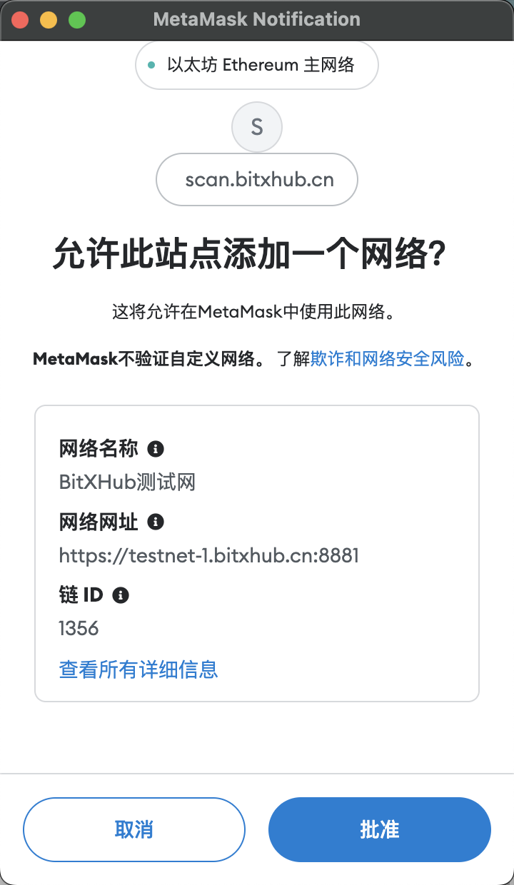
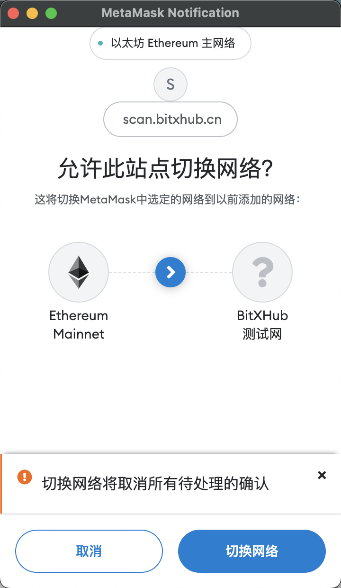
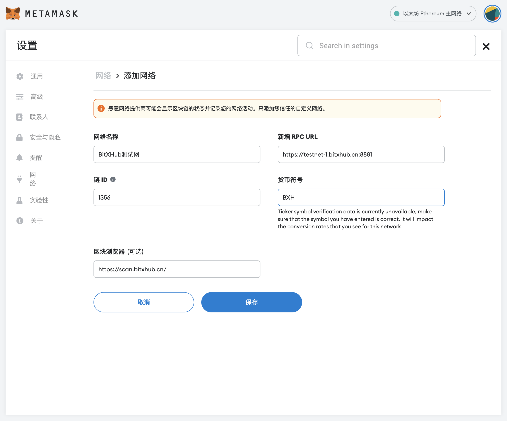
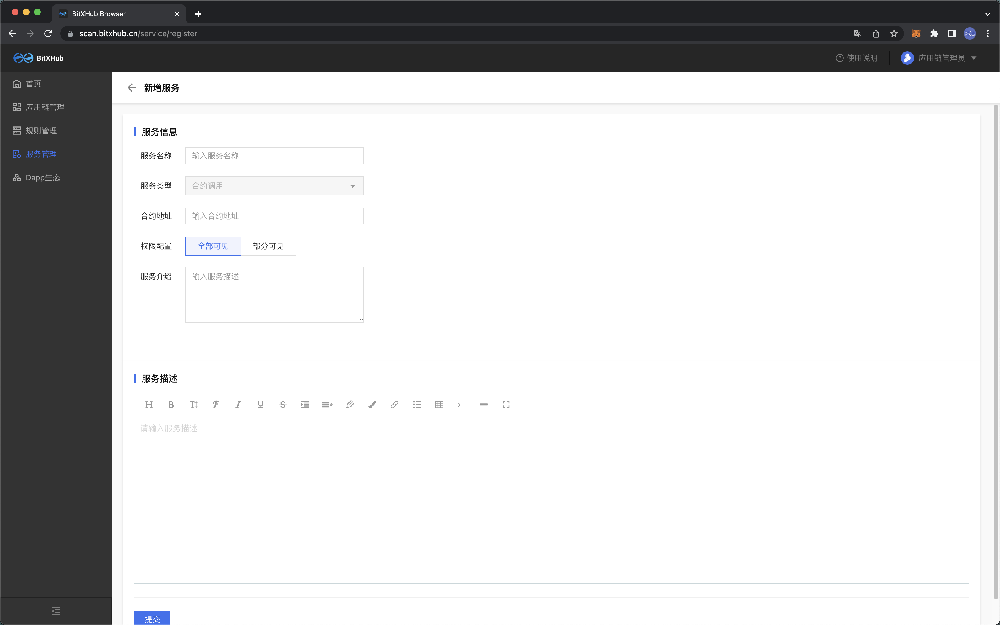

# 跨链浏览器体验指南

## 一、测试网配置流程

我们建议使用 Google Chrome 并安装 [MetaMask](https://github.com/MetaMask/metamask-extension/releases/download/v10.0.1/metamask-chrome-10.0.1.zip) 钱包扩展程序(推荐使用10.0.1及以上)。以下是 [MetaMask 常见问题解答](https://metamask.io/faqs.html) 供参考！

### 测试网自动配置

MetaMask插件安装完成后，点击浏览器【登陆】按钮，系统会弹出测试网自动配置添加页面，用户点击【Approve】，即可成功添加BitXHub测试网。



BitXHub测试网络添加成功后，系统会提示您进行网络切换，用户点击【Switch network】，即可成功切换至BitXHub测试网络  并进行后续操作。



### 测试网RPC手动配置
选择顶部网络功能，然后选择【自定义RPC】进入网络配置页面。




### BitXHub测试网配置信息详情

**链ID**

```text
1356
```

**RPC URL**

```text
https://testnet-1.bitxhub.cn:8881
```

**区块链浏览器**

```text
https://scan.bitxhub.cn/
```

## 二、应用链环境准备

应用链接入中继链之前，需要进行相应的跨链合约部署以及跨链网关配置等操作。

### 部署跨链合约

参考[部署跨链合约](../bitxhub/quick_start/build_cross_network/single_bitxhub/deploy_broker)相关文档。

### 获取Pier部署包和修改配置

参考[跨链网关部署](../bitxhub/quick_start/build_cross_network/single_bitxhub/deploy_pier)相关文档。

**注意：**

1）文档中提到的二进制或开源项目，均是要对应v2.0.0的版本；

2）以上pier配置过程，pier.toml中关于应用链的部分需要特别注意，chainID以注册应用时的chainID为准，ethereum为例，[appchain]字段下的配置示例如下，

```toml
[mode.relay]
addrs = ["testnet-1.bitxhub.cn:60111"]

[appchain]
id = "${chainID}"
plugin = "appchain_plugin"
config = "ethereum"
```

### 获取应用链私钥（用于导入MetaMask钱包）

完成以上配置后，在页面上注册应用链之前，还需要将上一步pier配置目录下的key.json转换显示成可以导入MetaMask钱包的公私钥对，具体示例如下：

```shell
# 1.进入到pier的配置主目录，即pier.toml所在的目录
# 执行pier show命令
pier show --path ~/.pier/key.json
# 返回结果示例：
private key: 0x88b434530176d3faf4dbf10ede1c25c4f7af673392152d71a18758a1ba677ddc
public key: 0x041b311209c6feb1587aaf16d7a1bac9f96c1fecb539d4cde416f97ff5048139beeac307d14d0e7196c7e15ad657530dedcc33bbe821276dadf3989bfff470747a
address: 0xE7f5E3c3963c6a588AB3de753817B3F735a6Ab58
# 将返回的private key的字符串导入到MetaMask钱包即可
```

## 三、浏览器可视化操作

**Browser URL**

```html
https://scan.bitxhub.cn
```

### 用户实名绑定

BitXHub测试网络下，新用户首次点击【登陆】，需要完成手机实名绑定，系统会提示【正在为您跳转，请先完成用户注册】，并跳转到注册页面。


注册页面中，用户需要输入手机号进行验证码校验，完成密码设置后，点击【注册】，即可跳转返回跨链浏览器页面。新用户完成注册后，您的地址1h内将收到BitXHub测试网发送的燃料费用于跨链体验。


### 应用链注册申请


注册字段说明：

1. 应用链ID：应用链的唯一ID

2. 应用链名称：自定义应用链的名称；

3. 应用链管理员地址：应用链的管理员地址，默认注册应用链的账户为管理员

4. 应用链类型：分为Fabric V1.4.3、Fabric V1.4.4 、Hyperchain V1.8.3等等（用户可选择ETH应用链类型进行快速跨链体验）

5. 验证规则：分为Fabric V1.4.3、Fabric V1.4.4 、无验证规则和 其他 四类（用户可选择无验证规则模式进行快速跨链体验），根据对应应用链类型选择合适的验证规则。注意其他类型需要提交自定义的验证规则，并附带源码链接。编写规则请参考[验证规则编写](../bitxhub/dev/rule)

6. 信任根：根据对应应用链类型选择合适的信任根

7. broker合约地址：应用链上部署的broker合约地址；

8. 应用链简介：描述应用链介绍

9. 申请理由：填写申请接入跨链系统的理由

应用链接入BitXHub跨链系统需要获得中继链管理员的准入审批，中继链管理员会在24h内完成应用链注册申请审核，审核通过即可接入应用链。

### 应用链服务注册申请

应用链服务指的是在应用链上的具体业务合约构成的区块链服务功能，例如存证服务、转账服务。中继链对需要跨链的服务存在权限控制，只有应用链管理员向中继链发起服务注册请求并且中继链管理员审核通过的服务才能参与跨链。



注册字段说明：

1. 服务名称：自定义应用链服务的名称

2. 服务类型：默认为合约调用

3. 合约地址：服务在应用链上的地址（ps: eth:0x0E2F76780d847a793700438d6224A6224bc4F941; fabric:mychannel&transfer）

4. 权限配置：控制服务权限的范围

5. 服务介绍：简单描述服务的内容

6. 服务描述：详细描述服务的内容（支持富文本编辑）

应用链服务接入BitXHub跨链系统需要获得中继链管理员的准入审批，中继链管理员会在24h内完成应用链服务注册申请审核，审核通过即可接入应用链服务。

## 四、网关启动

在完成以上步骤之后，用户启动跨链网关，即完成应用链接入跨链系统的操作。

```bash
#以用户目录下的pier为例
pier --repo=~/.pier start
```